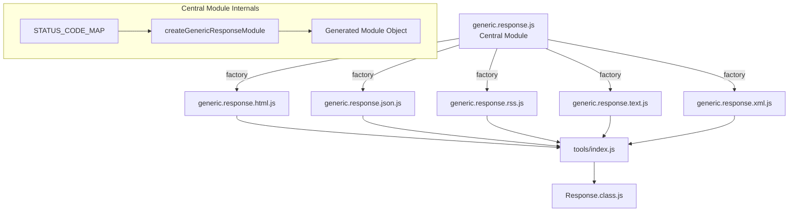

# Design Document: Clean Up Generic Responses

## Overview

This design introduces a centralized `generic.response.js` module that encapsulates the shared response logic currently duplicated across five format-specific files (`html`, `json`, `rss`, `text`, `xml`). The central module exports a factory function `createGenericResponseModule(contentType, bodyFormatter)` that generates a complete response module object. Each format file is refactored to a thin wrapper that calls this factory with its content type and body formatter, then re-exports the result alongside its format-specific helper function.

The refactoring eliminates the duplicated switch statement and ten response object definitions from each file while preserving byte-identical output for all existing consumers. The `response()` function on the returned module uses `this`-based property lookup (matching the current behavior) so that the `Response` class `init()` merge pattern continues to work.

## Architecture



The central module owns:
- The `STATUS_CODE_MAP` mapping status codes to default message strings
- The `createGenericResponseModule` factory function
- The `response()` lookup function (generated per module, bound via `this`)

Each format file owns:
- Its content type string
- Its body formatter function (format-specific transformation)
- Its format helper function export (e.g., `html()`, `json()`)

### Design decisions

1. **Factory returns a plain object, not a class**: The current modules export plain objects. Switching to a class would break the spread-merge pattern used by `Response.init()`. A plain object preserves this behavior.

2. **`response()` uses `this` keyword**: The current implementation references `this.response200`, etc. This is critical because `Response.init()` merges overrides onto the module object using spread (`{ ...module, ...overrides }`). The `response()` function must look up properties on `this` at call time so overrides take effect.

3. **Body formatter receives `(statusCode, message)` for all formats**: The HTML format needs the status code to construct its title (e.g., `"404 Not Found"`). Rather than special-casing HTML, all body formatters receive both arguments. Non-HTML formatters simply ignore the status code parameter.

4. **RSS/XML 418 message preserved via body formatter**: The RSS and XML formats prefix the 418 message with `"418 "` (producing `"418 I'm a teapot"`). This is handled inside each format's body formatter, not in the central module, preserving backwards compatibility without polluting the shared status code map.

5. **HTML title construction in body formatter**: The HTML body formatter constructs the title internally from the status code and message (e.g., `"404 Not Found"`), with a special case for 500 which uses `"500 Error"` instead of `"500 Internal Server Error"`.

## Components and Interfaces

### Central Module: `generic.response.js`

**Location**: `src/lib/tools/generic.response.js`

**Exports**:

```javascript
/**
 * Create a complete generic response module for a given content type and body formatter.
 *
 * @param {string} contentType - MIME content type string (e.g., "application/json")
 * @param {function(number, string): *} bodyFormatter - Function that transforms (statusCode, message) into format-specific body
 * @returns {{contentType: string, headers: Object, response200: Object, response400: Object, response401: Object, response403: Object, response404: Object, response405: Object, response408: Object, response418: Object, response427: Object, response500: Object, response: function(number|string): Object}}
 */
function createGenericResponseModule(contentType, bodyFormatter) { }

module.exports = { createGenericResponseModule };
```

**Internal constant**:

```javascript
const STATUS_CODE_MAP = {
	200: "Success",
	400: "Bad Request",
	401: "Unauthorized",
	403: "Forbidden",
	404: "Not Found",
	405: "Method Not Allowed",
	408: "Request Timeout",
	418: "I'm a teapot",
	427: "Too Many Requests",
	500: "Internal Server Error"
};
```

The factory iterates over `STATUS_CODE_MAP`, calls `bodyFormatter(statusCode, message)` for each entry, and builds the response objects. It then attaches a `response()` function that parses the status code to an integer and looks up `this[`response${statusCode}`]`, falling back to `this.response500`.

### Refactored Format Files

Each format file becomes a thin wrapper. Example for JSON:

```javascript
const { createGenericResponseModule } = require("./generic.response");

const jsonBodyFormatter = (statusCode, message) => ({ message });

const json = function (data = null) {
	return data ? data : {};
};

const mod = createGenericResponseModule("application/json", jsonBodyFormatter);

module.exports = { ...mod, json };
```

#### Body Formatter signatures per format

| Format | Body Formatter | Notes |
|--------|---------------|-------|
| HTML | `(statusCode, message) => html(titleFor(statusCode, message), "<p>" + message + "</p>")` | `titleFor` builds `"404 Not Found"`, special-cases 500 as `"500 Error"` |
| JSON | `(statusCode, message) => ({ message })` | Wraps message in object |
| RSS | `(statusCode, message) => rss(xmlTag(statusCode, message))` | Uses `<hello>` for 200, `<error>` for others. Prefixes 418 message with `"418 "` |
| Text | `(statusCode, message) => message` | Pass-through |
| XML | `(statusCode, message) => xml(xmlTag(statusCode, message))` | Uses `<hello>` for 200, `<error>` for others. Prefixes 418 message with `"418 "` |

#### HTML title mapping

The HTML format constructs titles as `"{statusCode} {titleText}"` where `titleText` matches the current output:

| Status Code | Title | Body |
|-------------|-------|------|
| 200 | `200 OK` | `<p>Success</p>` |
| 400 | `400 Bad Request` | `<p>Bad Request</p>` |
| 401 | `401 Unauthorized` | `<p>Unauthorized</p>` |
| 403 | `403 Forbidden` | `<p>Forbidden</p>` |
| 404 | `404 Not Found` | `<p>Not Found</p>` |
| 405 | `405 Method Not Allowed` | `<p>Method Not Allowed</p>` |
| 408 | `408 Request Timeout` | `<p>Request Timeout</p>` |
| 418 | `418 I'm a teapot` | `<p>I'm a teapot</p>` |
| 427 | `427 Too Many Requests` | `<p>Too Many Requests</p>` |
| 500 | `500 Error` | `<p>Internal Server Error</p>` |

The HTML body formatter will use a `TITLE_MAP` to handle the title text, since most titles match the message but 200 uses `"OK"` and 500 uses `"Error"`:

```javascript
const HTML_TITLE_MAP = {
	200: "OK",
	500: "Error"
};
```

For any status code, the title text is `HTML_TITLE_MAP[statusCode] || message`.

### tools/index.js

No changes required. The existing `require('./generic.response.json')` etc. will continue to work since the format files still export the same interface.

### Response.class.js

No changes required. The `Response` class imports the format files and stores them as private static fields. The spread-merge pattern in `init()` and the `this`-based `response()` lookup both continue to work because the factory produces the same object shape.

## Data Models

### Response_Object

```javascript
{
	statusCode: number,    // HTTP status code (e.g., 200, 404, 500)
	headers: {
		"Content-Type": string  // MIME type matching the format's contentType
	},
	body: *                // Format-specific: string (HTML/RSS/XML/Text) or Object (JSON)
}
```

### Module Object (returned by factory)

```javascript
{
	contentType: string,       // MIME content type string
	headers: {                 // Shared headers object
		"Content-Type": string
	},
	response200: Response_Object,
	response400: Response_Object,
	response401: Response_Object,
	response403: Response_Object,
	response404: Response_Object,
	response405: Response_Object,
	response408: Response_Object,
	response418: Response_Object,
	response427: Response_Object,
	response500: Response_Object,
	response: function(number|string): Response_Object  // Lookup function
}
```

### STATUS_CODE_MAP

```javascript
{
	200: "Success",
	400: "Bad Request",
	401: "Unauthorized",
	403: "Forbidden",
	404: "Not Found",
	405: "Method Not Allowed",
	408: "Request Timeout",
	418: "I'm a teapot",
	427: "Too Many Requests",
	500: "Internal Server Error"
}
```


## Correctness Properties

*A property is a characteristic or behavior that should hold true across all valid executions of a system — essentially, a formal statement about what the system should do. Properties serve as the bridge between human-readable specifications and machine-verifiable correctness guarantees.*

### Property 1: Factory structural completeness

*For any* content type string and any body formatter function, calling `createGenericResponseModule(contentType, bodyFormatter)` should return an object containing exactly the properties `contentType`, `headers`, `response200`, `response400`, `response401`, `response403`, `response404`, `response405`, `response408`, `response418`, `response427`, `response500`, and `response`, where `headers["Content-Type"]` equals the provided content type string.

**Validates: Requirements 1.1, 5.7**

### Property 2: Known status code lookup (int and string)

*For any* module produced by the factory and *for any* status code in the set {200, 400, 401, 403, 404, 405, 408, 418, 427, 500}, calling `response(statusCode)` with the integer value or its string representation should return a Response_Object whose `statusCode` field equals that integer.

**Validates: Requirements 1.3, 1.5**

### Property 3: Unknown status code fallback

*For any* module produced by the factory and *for any* integer not in the set {200, 400, 401, 403, 404, 405, 408, 418, 427, 500}, calling `response(unknownCode)` should return the same Response_Object as `response(500)`.

**Validates: Requirements 1.4**

### Property 4: Backwards compatibility of format output

*For any* format in {html, json, rss, text, xml} and *for any* status code in the supported set, the refactored format module's `response(statusCode)` must return a Response_Object with identical `statusCode`, `headers`, and `body` values to the original (pre-refactoring) implementation.

**Validates: Requirements 3.1, 3.2**

### Property 5: Body formatter invocation

*For any* content type string and *for any* body formatter function, the factory should call the body formatter exactly once per status code entry in the STATUS_CODE_MAP, passing the status code (number) and message (string) as arguments.

**Validates: Requirements 5.6**

## Error Handling

The generic response module has minimal error surface since it deals with static data generation:

- **Invalid status code to `response()`**: Non-numeric strings or values that `parseInt` cannot parse will result in `NaN`, which won't match any known code, triggering the fallback to `response500`. This matches the current behavior.
- **Missing body formatter**: If `bodyFormatter` is not a function, the factory will throw a `TypeError` when attempting to call it during module construction. This is acceptable since it's a programming error caught at module load time, not at runtime.
- **Null/undefined content type**: The factory will set `headers["Content-Type"]` to the provided value. Passing `null` or `undefined` would produce invalid headers, but this is a programming error in the format file, not a runtime concern.

No new error handling patterns are introduced. The existing behavior of falling back to the 500 response for unrecognized status codes is preserved.

## Testing Strategy

### Existing tests (must pass without modification)

The five existing Jest test files in `test/response/` validate the exact output of each format module. These serve as the primary regression safety net:

- `generic-response-html-tests.jest.mjs`
- `generic-response-json-tests.jest.mjs`
- `generic-response-rss-tests.jest.mjs`
- `generic-response-text-tests.jest.mjs`
- `generic-response-xml-tests.jest.mjs`
- `response-tests.jest.mjs` (Response class integration)

### New test file

**File**: `test/response/generic-response-module-tests.jest.mjs`

**Unit tests** (specific examples and edge cases):
- Factory produces a module with all 10 response objects for a given content type
- STATUS_CODE_MAP contains exactly the 10 expected entries with correct messages
- `response()` returns `response500` for code `999`, `0`, `-1`, `NaN` (from non-numeric string)
- `response()` handles string `"404"` the same as integer `404`
- Headers object contains the correct `Content-Type` value
- Each format file exports its format helper function (`html`, `json`, `rss`, `text`, `xml`)
- The `json()` helper still returns `data || {}`

**Property-based tests** (using fast-check, minimum 100 iterations):

Each property test must reference its design document property with a comment tag.

- **Feature: 1-3-10-clean-up-generic-responses, Property 1: Factory structural completeness** — Generate random content type strings and body formatter functions, verify the returned module has all required properties and correct Content-Type header.
- **Feature: 1-3-10-clean-up-generic-responses, Property 2: Known status code lookup** — For a randomly selected known status code (as int or string), verify `response()` returns the matching Response_Object.
- **Feature: 1-3-10-clean-up-generic-responses, Property 3: Unknown status code fallback** — Generate random integers outside the known set, verify `response()` returns the 500 object.
- **Feature: 1-3-10-clean-up-generic-responses, Property 4: Backwards compatibility** — For a randomly selected (format, statusCode) pair, verify the refactored output matches the expected original output exactly.
- **Feature: 1-3-10-clean-up-generic-responses, Property 5: Body formatter invocation** — Pass a tracking body formatter to the factory, verify it was called exactly once per status code with the correct arguments.

**Property-based testing library**: `fast-check` (already a project dependency)

**Configuration**: Each property test runs a minimum of 100 iterations. Each test includes a comment tag in the format: `Feature: 1-3-10-clean-up-generic-responses, Property {number}: {title}`.
