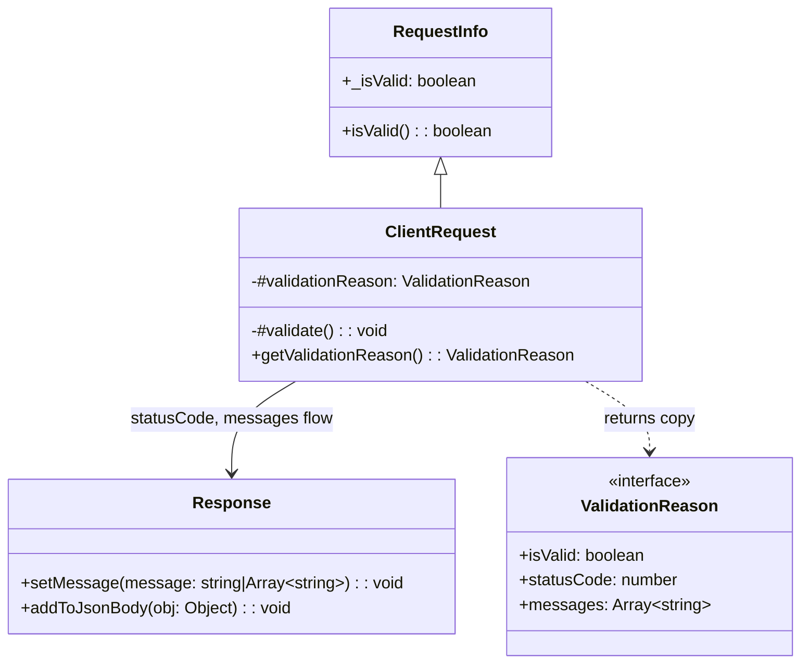

# Design Document: Enhance Invalid Request Messaging

## Overview

This feature adds structured validation failure reporting to the `ClientRequest` class and a message convenience method to the `Response` class. Currently, `ClientRequest.isValid()` returns a simple boolean with no detail about what failed or what HTTP status code is appropriate. This design introduces:

1. A private `#validationReason` object populated during `#validate()` that captures `isValid`, `statusCode`, and `messages` for each validation failure.
2. A public `getValidationReason()` method on `ClientRequest` that returns a defensive copy of the stored validation reason.
3. A public `setMessage(message)` method on `Response` that merges a `message` (string) or `messages` (array) property into the JSON body.
4. Full backwards compatibility with the existing `isValid()` boolean API on `RequestInfo`.

The design minimizes changes to the existing validation flow. The `#validate()` method already calls `isAuthorizedReferrer()`, `#hasValidPathParameters()`, `#hasValidQueryStringParameters()`, `#hasValidHeaderParameters()`, `#hasValidCookieParameters()`, and `#hasValidBodyParameters()` in sequence. Each of these returns a boolean. The enhancement wraps this flow to also collect failure reasons and status codes without altering the boolean result or the short-circuit behavior.

## Architecture

The feature touches two existing public classes (`ClientRequest` and `Response`) and does not introduce any new classes or modules. No new files are created in `src/`.



### Design Decisions

1. **No new classes**: `ValidationReason` is a plain object, not a class. This keeps the API simple and avoids adding exports.
2. **Defensive copy on read**: `getValidationReason()` returns a new object with a shallow-copied `messages` array on each call to prevent external mutation of internal state.
3. **Status code priority**: When multiple checks fail, the highest-priority status code wins: `401 > 403 > 400`. This is implemented by tracking the current highest-priority code and upgrading it as failures are discovered.
4. **Message accumulation**: All failure messages are collected into a single array regardless of which checks fail. This gives consumers full visibility.
5. **Minimal overhead**: The `#validationReason` object is populated during the existing `#validate()` call. No additional validation passes are needed. If `getValidationReason()` is never called, the only overhead is storing a small object.
6. **`setMessage()` uses existing `addToJsonBody()`**: The Response convenience method delegates to the existing `addToJsonBody()` mechanism, keeping the implementation minimal and consistent.

## Components and Interfaces

### ClientRequest Changes

#### New Private Field

```javascript
#validationReason = { isValid: true, statusCode: 200, messages: [] };
```

Initialized to the "valid" state. Populated during `#validate()`.

#### Modified `#validate()` Method

The existing `#validate()` method currently short-circuits on the first failure using `&&`:

```javascript
valid = this.isAuthorizedReferrer() && this.#hasValidPathParameters() && ...
```

The modified version runs all checks (no short-circuit) to collect all failure messages. Each check's result is inspected, and on failure, the appropriate status code and message(s) are recorded. After all checks, `super._isValid` is set to the combined boolean result, and `#validationReason` is finalized.

The modified flow:

```javascript
#validate() {
    const reasons = [];
    let statusCode = 200;

    // Referrer check
    const referrerValid = this.isAuthorizedReferrer();
    if (!referrerValid) {
        reasons.push("Forbidden");
        statusCode = this.#upgradeStatusCode(statusCode, 403);
    }

    // Authentication check
    if (this.hasNoAuthorization()) {
        reasons.push("Unauthorized");
        statusCode = this.#upgradeStatusCode(statusCode, 401);
    }

    // Parameter checks - collect invalid parameter names
    const pathValid = this.#hasValidPathParameters();
    const queryValid = this.#hasValidQueryStringParameters();
    const headerValid = this.#hasValidHeaderParameters();
    const cookieValid = this.#hasValidCookieParameters();
    const bodyValid = this.#hasValidBodyParameters();

    // ... collect "Invalid parameter: {name}" messages for each failed param
    // ... set statusCode to 400 if any param check fails

    const valid = referrerValid && !this.hasNoAuthorization()
        && pathValid && queryValid && headerValid && cookieValid && bodyValid;

    super._isValid = valid;

    this.#validationReason = {
        isValid: valid,
        statusCode: valid ? 200 : statusCode,
        messages: valid ? [] : reasons
    };
}
```

**Note on parameter failure messages**: The current `#hasValidParameters()` method logs `DebugAndLog.warn("Invalid parameter: {paramKey}")` and returns early on the first invalid parameter per parameter type. To collect per-parameter failure messages, the `#hasValidParameters()` method will be enhanced to also return the names of invalid parameters. This is an internal-only change (private method) and does not affect the public API.

#### New Private Method: `#upgradeStatusCode(current, candidate)`

Returns the higher-priority status code. Priority order: `401 > 403 > 400 > 200`.

```javascript
#upgradeStatusCode(current, candidate) {
    const priority = { 401: 3, 403: 2, 400: 1, 200: 0 };
    return (priority[candidate] || 0) > (priority[current] || 0) ? candidate : current;
}
```

#### New Public Method: `getValidationReason()`

```javascript
/**
 * Returns a structured validation result object describing why the request
 * passed or failed validation.
 *
 * @returns {{ isValid: boolean, statusCode: number, messages: Array<string> }}
 *   A new object on each call containing:
 *   - isValid: whether the request passed all validation checks
 *   - statusCode: the appropriate HTTP status code (200, 400, 401, or 403)
 *   - messages: array of descriptive failure messages (empty when valid)
 * @example
 * // Valid request
 * const reason = clientRequest.getValidationReason();
 * // { isValid: true, statusCode: 200, messages: [] }
 *
 * @example
 * // Invalid request with bad parameters
 * const reason = clientRequest.getValidationReason();
 * // { isValid: false, statusCode: 400, messages: ["Invalid parameter: limit"] }
 */
getValidationReason() {
    return {
        isValid: this.#validationReason.isValid,
        statusCode: this.#validationReason.statusCode,
        messages: [...this.#validationReason.messages]
    };
}
```

### Response Changes

#### New Public Method: `setMessage(message)`

```javascript
/**
 * Sets a message or messages property on the JSON response body.
 *
 * @param {string|Array<string>} message - A single message string or array of message strings
 * @returns {void}
 * @example
 * response.setMessage("Invalid parameter: limit");
 * // body becomes: { ...existingBody, message: "Invalid parameter: limit" }
 *
 * @example
 * response.setMessage(["Invalid parameter: limit", "Invalid parameter: offset"]);
 * // body becomes: { ...existingBody, messages: ["Invalid parameter: limit", "Invalid parameter: offset"] }
 */
setMessage = (message) => {
    if (Array.isArray(message)) {
        this.addToJsonBody({ messages: message });
    } else {
        this.addToJsonBody({ message: message });
    }
};
```

This method:
- Accepts a string → merges `{ message: str }` into body
- Accepts an array → merges `{ messages: arr }` into body
- Does not alter status code or headers
- Only works when body is a JSON object (same constraint as `addToJsonBody()`)
- Is a no-op when body is not an object (consistent with `addToJsonBody()` behavior)

### Integration Pattern

Typical usage by a consuming application:

```javascript
const clientRequest = new ClientRequest(event, context);
const response = new Response(clientRequest);

if (!clientRequest.isValid()) {
    const reason = clientRequest.getValidationReason();
    response.reset({ statusCode: reason.statusCode });
    response.setMessage(reason.messages);
    return response.finalize();
}
```

## Data Models

### ValidationReason Object

A plain JavaScript object (not a class) with the following shape:

| Property    | Type             | Description                                                    |
|-------------|------------------|----------------------------------------------------------------|
| `isValid`   | `boolean`        | `true` if all validation checks passed, `false` otherwise     |
| `statusCode`| `number`         | HTTP status code: `200`, `400`, `401`, or `403`                |
| `messages`  | `Array<string>`  | Descriptive failure messages; empty array when valid            |

### Status Code Priority Map

| Status Code | Priority | Trigger                          |
|-------------|----------|----------------------------------|
| `401`       | 3 (highest) | Authentication/authorization failure |
| `403`       | 2        | Referrer whitelist failure        |
| `400`       | 1        | Parameter validation failure      |
| `200`       | 0        | All checks passed                 |

### Message Formats

| Failure Type          | Message Format                        |
|-----------------------|---------------------------------------|
| Referrer failure      | `"Forbidden"`                         |
| Authentication failure| `"Unauthorized"`                      |
| Parameter failure     | `"Invalid parameter: {parameterName}"`|
| Invalid JSON body     | `"Invalid request body"`              |


## Correctness Properties

*A property is a characteristic or behavior that should hold true across all valid executions of a system — essentially, a formal statement about what the system should do. Properties serve as the bridge between human-readable specifications and machine-verifiable correctness guarantees.*

### Property 1: Valid request produces canonical validation reason

*For any* `ClientRequest` constructed from an event that passes all validation checks (valid referrer, valid authentication, valid parameters), `getValidationReason()` should return `{ isValid: true, statusCode: 200, messages: [] }`.

**Validates: Requirements 1.2, 2.2**

### Property 2: Invalid request produces well-formed validation reason

*For any* `ClientRequest` constructed from an event that fails at least one validation check, `getValidationReason()` should return an object where `isValid` is `false`, `statusCode` is a number not equal to `200`, and `messages` is a non-empty array of strings.

**Validates: Requirements 1.1, 2.3**

### Property 3: Referrer failure maps to 403

*For any* `ClientRequest` constructed with a referrer not in the whitelist (and no higher-priority failure), `getValidationReason().statusCode` should be `403` and `getValidationReason().messages` should contain a referrer-related message.

**Validates: Requirements 1.3**

### Property 4: Authentication failure maps to 401

*For any* `ClientRequest` constructed where the authentication check fails (and authentication is required), `getValidationReason().statusCode` should be `401` and `getValidationReason().messages` should contain `"Unauthorized"`.

**Validates: Requirements 1.4**

### Property 5: Parameter failure maps to 400 with per-parameter messages

*For any* `ClientRequest` constructed with one or more invalid parameters (path, query, header, cookie, or body) and no higher-priority failure, `getValidationReason().statusCode` should be `400` and `getValidationReason().messages` should contain a message matching `"Invalid parameter: {parameterName}"` for each invalid parameter.

**Validates: Requirements 1.5, 4.1, 4.2, 4.3, 4.4, 4.6**

### Property 6: Invalid JSON body maps to 400 with body message

*For any* `ClientRequest` constructed with a non-empty body string that is not valid JSON, `getValidationReason().statusCode` should be `400` and `getValidationReason().messages` should contain `"Invalid request body"`.

**Validates: Requirements 4.5**

### Property 7: Status code priority ordering

*For any* `ClientRequest` constructed from an event that triggers multiple validation failures, the `statusCode` in `getValidationReason()` should be the highest-priority code among the failures, where `401 > 403 > 400`. All failure messages from all failing checks should be present in the `messages` array.

**Validates: Requirements 1.6**

### Property 8: Defensive copy prevents mutation

*For any* `ClientRequest` instance, calling `getValidationReason()` twice should return two distinct object references. Mutating the first returned object (e.g., pushing to its `messages` array) should not affect the second returned object or subsequent calls.

**Validates: Requirements 2.4**

### Property 9: Backwards compatibility — isValid consistency

*For any* `ClientRequest` instance, `isValid()` should return a boolean, and its value should equal `getValidationReason().isValid`. The existing boolean API is preserved.

**Validates: Requirements 3.1, 3.3**

### Property 10: setMessage with string merges message property

*For any* `Response` instance with a JSON object body and *for any* non-empty string `s`, calling `setMessage(s)` should result in `getBody().message === s` without altering `getStatusCode()` or `getHeaders()`.

**Validates: Requirements 5.2, 5.4**

### Property 11: setMessage with array merges messages property

*For any* `Response` instance with a JSON object body and *for any* non-empty array of strings `arr`, calling `setMessage(arr)` should result in `getBody().messages` being deep-equal to `arr` without altering `getStatusCode()` or `getHeaders()`.

**Validates: Requirements 5.3, 5.4**

### Property 12: Integration — validation reason flows to Response

*For any* invalid `ClientRequest`, passing `getValidationReason().statusCode` to `Response.reset({ statusCode })` should produce a response with that status code, and passing `getValidationReason().messages` to `Response.setMessage()` should merge the messages into the response body without error.

**Validates: Requirements 6.1, 6.2, 6.3**

## Error Handling

### ClientRequest Error Handling

1. **JSON parse failure in body**: When `#hasValidBodyParameters()` encounters invalid JSON, it catches the parse error, logs via `DebugAndLog.error()`, sets `bodyParameters` to `{}`, adds `"Invalid request body"` to the validation reason messages, and returns `false`. This is existing behavior enhanced with message collection.

2. **Null/undefined event fields**: The existing null-safe access patterns (`this.#event?.pathParameters`, etc.) are preserved. Missing parameter objects are treated as empty, resulting in no validation failures for those parameter types.

3. **getValidationReason() before construction completes**: Not possible — `#validationReason` is initialized to the valid state in the field declaration and populated during `#validate()`, which runs in the constructor. By the time the instance is available to the caller, the reason is fully populated.

### Response Error Handling

1. **setMessage() with non-object body**: `addToJsonBody()` already checks `typeof this._body === 'object'` and is a no-op otherwise. `setMessage()` inherits this behavior — calling it when the body is a string or null has no effect and does not throw.

2. **setMessage() with null/undefined argument**: Passing `null` or `undefined` will merge `{ message: null }` or `{ message: undefined }` into the body. This is consistent with `addToJsonBody()` behavior. Consumers should validate their input before calling.

## Testing Strategy

### Dual Testing Approach

This feature requires both unit tests and property-based tests:

- **Unit tests**: Verify specific examples, edge cases, and error conditions for `getValidationReason()` and `setMessage()`.
- **Property-based tests**: Verify universal properties across randomly generated inputs using fast-check.

### Property-Based Testing Configuration

- **Library**: fast-check (already a project dependency)
- **Framework**: Jest (`.jest.mjs` files)
- **Minimum iterations**: 100 per property test
- **Each property test must reference its design document property**
- **Tag format**: `Feature: enhance-invalid-request-messaging, Property {number}: {property_text}`
- **Each correctness property must be implemented by a single property-based test**

### Test File Organization

```
test/
├── request/
│   ├── validation-reason-unit-tests.jest.mjs          # Unit tests for getValidationReason()
│   └── validation-reason-property-tests.jest.mjs      # Property tests for Properties 1-9, 12
├── response/
│   ├── set-message-unit-tests.jest.mjs                # Unit tests for setMessage()
│   └── set-message-property-tests.jest.mjs            # Property tests for Properties 10-11
```

### Unit Test Coverage

Unit tests should focus on:

- Specific examples demonstrating each failure type (referrer, auth, parameter, body)
- Edge cases: empty event, null parameters, empty strings, multiple simultaneous failures
- Error conditions: invalid JSON body, missing fields
- Integration: passing validation reason to Response
- Backwards compatibility: `isValid()` still returns boolean
- `setMessage()` with string, array, empty array, non-object body
- `getValidationReason()` returns new object each call

### Property Test Coverage

Each correctness property (1-12) maps to a single property-based test. Generators should produce:

- Random valid events (with whitelisted referrers, valid parameters)
- Random invalid events (bad referrers, bad parameters, bad JSON bodies)
- Random combinations of failure types for priority testing
- Random strings and string arrays for `setMessage()` testing
- Random JSON object bodies for Response body merging
