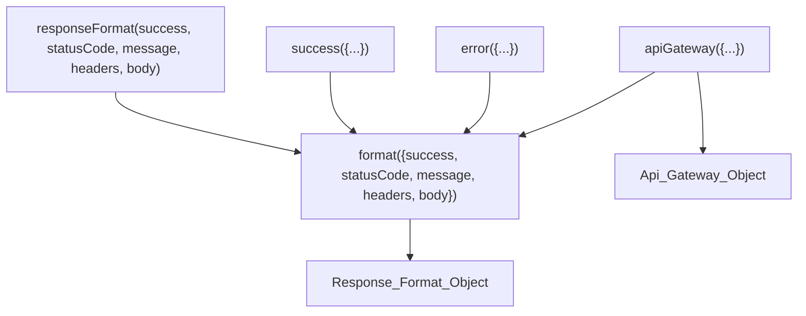

# Design Document: New Response Format Method

## Overview

This design introduces four new static methods on the `ApiRequest` class (`format()`, `success()`, `error()`, `apiGateway()`) that provide a modern, object-destructured API for creating standardized response format objects. The existing `responseFormat()` method is refactored to delegate to `format()`, centralizing the response construction logic while maintaining full backwards compatibility.

The primary motivation is developer ergonomics: the current `responseFormat()` uses five positional arguments, forcing developers to remember parameter order and pass `null` placeholders for unused fields. The new `format()` method accepts a single destructured object, allowing developers to specify only the fields they care about.

### Key Design Decisions

1. **Delegation over duplication**: `responseFormat()`, `success()`, and `error()` all delegate to `format()`, ensuring a single source of truth for response object construction.
2. **`apiGateway()` stringifies object bodies**: API Gateway Lambda proxy integration expects `body` as a string. The method handles this automatically, reducing a common source of bugs.
3. **Static methods only**: All new methods are static, matching the existing `responseFormat()` pattern. No instance state is needed.
4. **No new files**: All methods are added to the existing `ApiRequest` class in `src/lib/tools/ApiRequest.class.js`.

## Architecture

The new methods form a layered delegation chain:



All methods are static on the `ApiRequest` class. There are no new classes, modules, or external dependencies.

### Method Placement

The new methods will be added to `src/lib/tools/ApiRequest.class.js` immediately before the existing `responseFormat()` method (which is currently the last method in the class, around line 1516). The order within the class will be:

1. `format()` — core method
2. `success()` — shortcut delegating to `format()`
3. `error()` — shortcut delegating to `format()`
4. `apiGateway()` — conversion method delegating to `format()`
5. `responseFormat()` — legacy method, refactored to delegate to `format()`

## Components and Interfaces

### `ApiRequest.format(options)`

Core static method. Accepts a single destructured `Format_Options` object and returns a `Response_Format_Object`.

```javascript
static format({
    success = false,
    statusCode = 0,
    message = null,
    headers = null,
    body = null
} = {}) {
    return { success, statusCode, message, headers, body };
}
```

**Defaults**: `success: false`, `statusCode: 0`, `message: null`, `headers: null`, `body: null`

### `ApiRequest.success(options)`

Shortcut for successful responses. Overrides defaults to success-oriented values, then delegates to `format()`.

```javascript
static success({
    success = true,
    statusCode = 200,
    message = "SUCCESS",
    headers = null,
    body = null
} = {}) {
    return ApiRequest.format({ success, statusCode, message, headers, body });
}
```

**Defaults**: `success: true`, `statusCode: 200`, `message: "SUCCESS"`, `headers: null`, `body: null`

### `ApiRequest.error(options)`

Shortcut for error responses. Overrides defaults to error-oriented values, then delegates to `format()`.

```javascript
static error({
    success = false,
    statusCode = 500,
    message = "ERROR",
    headers = null,
    body = null
} = {}) {
    return ApiRequest.format({ success, statusCode, message, headers, body });
}
```

**Defaults**: `success: false`, `statusCode: 500`, `message: "ERROR"`, `headers: null`, `body: null`

### `ApiRequest.apiGateway(options)`

Converts a `Format_Options` object into an `Api_Gateway_Object` suitable for AWS API Gateway Lambda proxy integration. Delegates to `format()` for normalization, then extracts and transforms the relevant fields.

```javascript
static apiGateway({
    success = false,
    statusCode = 0,
    message = null,
    headers = null,
    body = null
} = {}) {
    const resp = ApiRequest.format({ success, statusCode, message, headers, body });
    return {
        statusCode: resp.statusCode,
        headers: resp.headers,
        body: (resp.body !== null && typeof resp.body === "object") ? JSON.stringify(resp.body) : resp.body
    };
}
```

### `ApiRequest.responseFormat(success, statusCode, message, headers, body)` (Refactored)

The existing method signature is preserved exactly. The implementation is changed to delegate to `format()`.

```javascript
static responseFormat(success = false, statusCode = 0, message = null, headers = null, body = null) {
    return ApiRequest.format({ success, statusCode, message, headers, body });
}
```

## Data Models

### Response_Format_Object

Returned by `format()`, `success()`, `error()`, and `responseFormat()`.

| Property     | Type                      | Description                        |
|-------------|---------------------------|------------------------------------|
| `success`   | `boolean`                 | Whether the operation succeeded    |
| `statusCode`| `number`                  | HTTP status code                   |
| `message`   | `string \| null`          | Human-readable status message      |
| `headers`   | `object \| null`          | Response headers                   |
| `body`      | `object \| string \| null`| Response body                      |

The object always contains exactly these five properties.

### Api_Gateway_Object

Returned by `apiGateway()`.

| Property     | Type                | Description                                  |
|-------------|---------------------|----------------------------------------------|
| `statusCode`| `number`            | HTTP status code                             |
| `headers`   | `object \| null`    | Response headers                             |
| `body`      | `string \| null`    | Response body (objects are JSON.stringified)  |

The object always contains exactly these three properties. It never contains `success` or `message`.

### Format_Options (Input)

The destructured parameter accepted by `format()`, `success()`, `error()`, and `apiGateway()`.

| Property     | Type                      | Default (`format`/`apiGateway`) | Default (`success`) | Default (`error`) |
|-------------|---------------------------|-------------------------------|---------------------|-------------------|
| `success`   | `boolean`                 | `false`                       | `true`              | `false`           |
| `statusCode`| `number`                  | `0`                           | `200`               | `500`             |
| `message`   | `string \| null`          | `null`                        | `"SUCCESS"`         | `"ERROR"`         |
| `headers`   | `object \| null`          | `null`                        | `null`              | `null`            |
| `body`      | `object \| string \| null`| `null`                        | `null`              | `null`            |


## Correctness Properties

*A property is a characteristic or behavior that should hold true across all valid executions of a system — essentially, a formal statement about what the system should do. Properties serve as the bridge between human-readable specifications and machine-verifiable correctness guarantees.*

### Property 1: Round-Trip Equivalence (responseFormat ↔ format)

*For any* boolean `s`, number `c`, value `m`, value `h`, and value `b`, calling `ApiRequest.responseFormat(s, c, m, h, b)` shall produce a result deeply equal to `ApiRequest.format({success: s, statusCode: c, message: m, headers: h, body: b})`.

**Validates: Requirements 5.3, 5.4**

### Property 2: format() Idempotence

*For any* valid `Format_Options` object `opts`, calling `ApiRequest.format(ApiRequest.format(opts))` shall produce a result deeply equal to `ApiRequest.format(opts)`.

**Validates: Requirements 8.3**

### Property 3: format() Structural Invariant

*For any* valid `Format_Options` object (including empty/partial), the object returned by `ApiRequest.format()` shall contain exactly five keys: `success`, `statusCode`, `message`, `headers`, and `body`.

**Validates: Requirements 1.5, 8.7**

### Property 4: format() Value Preservation

*For any* set of values `{success, statusCode, message, headers, body}` passed to `ApiRequest.format()`, the returned object shall contain those exact values for each provided property, and default values for any omitted properties.

**Validates: Requirements 1.3, 1.4**

### Property 5: success() Default Success Flag

*For any* `Format_Options` object that does not include an explicit `success` property, calling `ApiRequest.success()` with that object shall return a `Response_Format_Object` where `success` is `true`.

**Validates: Requirements 2.3, 8.4**

### Property 6: error() Default Success Flag

*For any* `Format_Options` object that does not include an explicit `success` property, calling `ApiRequest.error()` with that object shall return a `Response_Format_Object` where `success` is `false`.

**Validates: Requirements 3.3, 8.5**

### Property 7: apiGateway() Structural Invariant

*For any* valid `Format_Options` object, the object returned by `ApiRequest.apiGateway()` shall contain exactly three keys (`statusCode`, `headers`, `body`) and shall never contain `success` or `message`.

**Validates: Requirements 4.3, 8.6**

### Property 8: apiGateway() Body Stringification

*For any* valid `Format_Options` object where `body` is a non-null object, `ApiRequest.apiGateway()` shall return a `body` equal to `JSON.stringify(originalBody)`. *For any* `Format_Options` where `body` is a string or `null`, the returned `body` shall be identical to the input `body`.

**Validates: Requirements 4.6, 4.7**

### Property 9: apiGateway() Preserves statusCode and headers

*For any* valid `Format_Options` object, `ApiRequest.apiGateway(opts).statusCode` shall equal `ApiRequest.format(opts).statusCode`, and `ApiRequest.apiGateway(opts).headers` shall deeply equal `ApiRequest.format(opts).headers`.

**Validates: Requirements 4.4, 4.5**

## Error Handling

These methods are pure data constructors with no I/O, no async operations, and no external dependencies. Error handling is minimal by design:

- **No argument validation**: The methods rely on JavaScript's destructuring defaults. If a caller passes unexpected types (e.g., a string for `statusCode`), the value is passed through as-is. This matches the existing `responseFormat()` behavior, which also performs no type checking.
- **No thrown exceptions**: None of the four methods throw exceptions under any input. `format()` always returns a plain object. `apiGateway()` calls `JSON.stringify()` on object bodies, which could theoretically throw on circular references, but this is consistent with standard JavaScript behavior and is not something we guard against (the existing codebase does not guard against this either).
- **Empty call safety**: All four methods can be called with no arguments (`ApiRequest.format()`, `ApiRequest.success()`, etc.) and will return valid objects with default values. This is ensured by the `= {}` default on the destructured parameter.

## Testing Strategy

### Unit Tests

A new file `test/response/response-format-unit-tests.jest.mjs` will contain Jest unit tests covering:

- `format()` with no arguments returns correct defaults
- `format()` with all properties returns exact values
- `format()` with partial properties uses defaults for omitted ones
- `success()` with no arguments returns `{success: true, statusCode: 200, message: "SUCCESS", headers: null, body: null}`
- `success()` with overrides (e.g., `{statusCode: 201, body: {id: 1}}`) applies them correctly
- `error()` with no arguments returns `{success: false, statusCode: 500, message: "ERROR", headers: null, body: null}`
- `error()` with overrides applies them correctly
- `apiGateway()` returns exactly three properties
- `apiGateway()` stringifies object bodies
- `apiGateway()` passes string bodies unchanged
- `apiGateway()` passes null bodies unchanged
- Refactored `responseFormat()` produces identical output to pre-refactor behavior for various argument combinations

### Property-Based Tests

A new file `test/response/response-format-property-tests.jest.mjs` will contain fast-check property tests. Each test will run a minimum of 100 iterations and reference its design property.

**Library**: `fast-check` (already in devDependencies)

**Generators**: Tests will use fast-check arbitraries to generate:
- `fc.boolean()` for `success`
- `fc.integer()` for `statusCode`
- `fc.oneof(fc.string(), fc.constant(null))` for `message`
- `fc.oneof(fc.dictionary(fc.string(), fc.string()), fc.constant(null))` for `headers`
- `fc.oneof(fc.string(), fc.dictionary(fc.string(), fc.jsonValue()), fc.constant(null))` for `body`

**Tag format**: Each property test will include a comment referencing the design property:
```javascript
// Feature: new-response-format-method, Property 1: Round-Trip Equivalence
```

**Properties to implement** (one test per property):

| Property | Test Description |
|----------|-----------------|
| Property 1 | `responseFormat(s,c,m,h,b)` deeply equals `format({success:s, statusCode:c, message:m, headers:h, body:b})` |
| Property 2 | `format(format(opts))` deeply equals `format(opts)` |
| Property 3 | `Object.keys(format(opts))` always has length 5 with the correct key names |
| Property 4 | Each provided value in opts appears unchanged in the output |
| Property 5 | `success(opts).success === true` when opts has no `success` key |
| Property 6 | `error(opts).success === false` when opts has no `success` key |
| Property 7 | `Object.keys(apiGateway(opts))` always equals `["statusCode", "headers", "body"]` |
| Property 8 | Object bodies are stringified; string/null bodies pass through |
| Property 9 | `apiGateway(opts).statusCode === format(opts).statusCode` and headers match |

**Configuration**: Each `fc.assert()` call will use `{ numRuns: 100, seed: process.env.FC_SEED ? parseInt(process.env.FC_SEED) : undefined }` for reproducibility.
