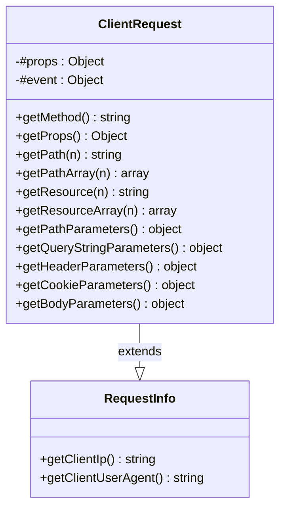

# Design Document: Add getMethod() to ClientRequest

## Overview

This design adds a `getMethod()` instance method to the `ClientRequest` class and normalizes the `method` property in the internal `#props` object to always store the HTTP method in uppercase. The change provides a direct accessor for the HTTP method (consistent with the existing getter pattern) and ensures consistent uppercase representation regardless of how the event source provides the method string.

This is a non-breaking MINOR change (v1.3.13) that adds new functionality without altering existing behavior for standard API Gateway events (which already provide uppercase methods).

## Architecture

The change is localized to a single class (`ClientRequest`) in `src/lib/tools/ClientRequest.class.js`. No new modules, classes, or dependencies are introduced.



**Design Decision**: The `getMethod()` method follows the same simple getter pattern as `getPathParameters()`, `getQueryStringParameters()`, etc. — it directly returns a value from `#props` with no parameters and no transformation logic. The uppercase normalization happens once in the constructor, not on every call to `getMethod()`.

## Components and Interfaces

### Modified Component: ClientRequest Constructor

**Current behavior:**
```javascript
this.#props = {
    method: this.#event.httpMethod,
    // ...
};
```

**New behavior:**
```javascript
this.#props = {
    method: (this.#event.httpMethod || '').toUpperCase(),
    // ...
};
```

**Rationale**: The `|| ''` guard handles the case where `httpMethod` is `null` or `undefined`, preventing a TypeError on `.toUpperCase()`. This defensive pattern is consistent with how other event fields are handled in the constructor (e.g., `this.#event?.body || null`).

### New Component: getMethod() Method

```javascript
/**
 * Returns the HTTP method of the request in uppercase.
 * The method is normalized to uppercase during construction regardless
 * of how the API Gateway event provides it.
 * @returns {string} HTTP method in uppercase (e.g., "GET", "POST", "PUT", "DELETE")
 * @example
 * const method = clientRequest.getMethod();
 * // method === "GET"
 */
getMethod() {
    return this.#props.method;
}
```

**Placement**: The method will be placed after `getBodyParameters()` and before `getProps()`, grouping it with the other simple property getters.

## Data Models

No new data models are introduced. The existing `#props` object retains its structure with the `method` field now guaranteed to be an uppercase string (or empty string if `httpMethod` was missing).

### Props Object Shape (unchanged key structure)

```javascript
{
    method: string,          // Now guaranteed uppercase
    path: string,
    pathArray: string[],
    resource: string,
    resourceArray: string[],
    pathParameters: object,
    queryStringParameters: object,
    headerParameters: object,
    cookieParameters: object,
    bodyParameters: object,
    bodyPayload: string|null,
    client: object,
    deadline: number,
    calcMsToDeadline: function
}
```

## Correctness Properties

*A property is a characteristic or behavior that should hold true across all valid executions of a system — essentially, a formal statement about what the system should do. Properties serve as the bridge between human-readable specifications and machine-verifiable correctness guarantees.*

### Property 1: Uppercase Normalization and Accessor Consistency

*For any* arbitrary string provided as the `httpMethod` field in an API Gateway event, both `getMethod()` and `getProps().method` SHALL return the same value, equal to the input string converted to uppercase via `toUpperCase()`.

**Validates: Requirements 1.2, 1.3, 1.4, 1.5, 2.1, 2.2, 2.3, 5.5, 5.6**

## Error Handling

### Null/Undefined httpMethod

When `this.#event.httpMethod` is `null` or `undefined`, the expression `(this.#event.httpMethod || '').toUpperCase()` evaluates to `''` (empty string). This is a safe default that:
- Prevents TypeError from calling `.toUpperCase()` on null/undefined
- Returns a consistent string type from `getMethod()`
- Maintains the existing behavior where downstream routing logic handles missing methods

### No New Error Conditions

The `getMethod()` method is a simple property accessor that cannot throw. It always returns a string value from `#props.method`, which is set during construction.

## Testing Strategy

### Property-Based Tests (fast-check)

**File**: `test/request/client-request-getmethod-property-tests.jest.mjs`

One property-based test validates the single correctness property:

- **Property 1**: Generate arbitrary strings (including empty, lowercase, uppercase, mixed-case, unicode, whitespace-only), construct a `ClientRequest` with that string as `httpMethod`, and verify:
  - `getMethod() === input.toUpperCase()`
  - `getProps().method === input.toUpperCase()`
  - `getMethod() === getProps().method`

**Configuration**: Minimum 100 iterations per property test using fast-check.

**Tag format**: `Feature: add-getmethod-to-clientrequest, Property 1: Uppercase Normalization and Accessor Consistency`

### Unit Tests (Jest)

**File**: `test/request/client-request-getmethod-unit-tests.jest.mjs`

Unit tests cover specific examples and edge cases:

1. `getMethod()` returns `'GET'` for standard GET event (backwards compatibility)
2. `getMethod()` returns `'POST'` for lowercase `'post'` event
3. `getMethod()` returns `'DELETE'` for mixed-case `'DeLeTe'` event
4. `getProps().method` is `'GET'` for lowercase `'get'` event
5. `getMethod()` returns empty string when `httpMethod` is `undefined`
6. `getMethod()` returns empty string when `httpMethod` is `null`
7. Existing test (`props.method === 'GET'`) continues to pass (verified by running existing test suite)

### Test Library

- **Property-based testing**: fast-check (already in devDependencies)
- **Test runner**: Jest with `.jest.mjs` extension
- **Assertions**: Jest built-in `expect`

### Documentation Updates

- Add JSDoc to `getMethod()` with `@returns {string}` and `@example`
- Update routing patterns documentation in `docs/01-advanced-implementation-for-web-service/` to show `getMethod()` usage
