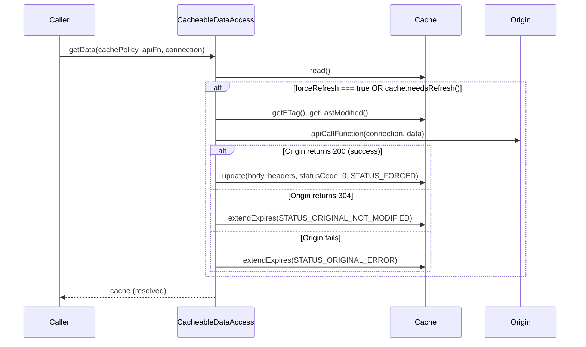

# Design Document: Force Refresh Option

## Overview

This feature adds a `forceRefresh` boolean option to `connection.options` that bypasses the cache expiration check in `CacheableDataAccess.getData()` and always fetches fresh data from the original source. The implementation leverages the existing architecture where `connection.options` is already excluded from cache hash generation, ensuring forced and non-forced requests share the same cache entry.

### Design Goals

- Minimal code change in `getData()` — a single conditional check
- Full backwards compatibility — no changes to method signatures or default behavior
- Resilient error handling — fall back to stale cache on origin failure
- Bandwidth efficiency — send conditional headers (ETag, If-Modified-Since) even during forced refresh
- Observable — use existing `STATUS_FORCED` status for logging

### Design Rationale

The simplest correct approach is to always call `cache.read()` (needed for conditional headers and error fallback), then check `forceRefresh || cache.needsRefresh()` to decide whether to fetch from origin. This avoids skipping the DynamoDB read entirely, which would sacrifice conditional request support and error resilience. The trade-off is one DynamoDB read per forced refresh, but this enables 304 responses that save bandwidth and provides stale data fallback on errors.

## Architecture



The key difference from the current flow is the condition change from `cache.needsRefresh()` to `forceRefresh || cache.needsRefresh()`. When `forceRefresh` is true and the origin returns success, the status is explicitly set to `Cache.STATUS_FORCED` via the `status` parameter of `cache.update()`.

## Components and Interfaces

### Modified: `CacheableDataAccess.getData()`

**File**: `src/lib/dao-cache.js`

**Change**: Add `forceRefresh` extraction and condition modification.

```javascript
// Extract forceRefresh from connection options (strict boolean check)
const forceRefresh = connection?.options?.forceRefresh === true;

await cache.read();

if ( forceRefresh || cache.needsRefresh() ) {
    // ... existing header assignment logic (ETag, Last-Modified) ...
    
    let originalSource = await apiCallFunction(connection, data);
    
    if ( originalSource.success ) {
        if (originalSource.statusCode === 304) {
            await cache.extendExpires(Cache.STATUS_ORIGINAL_NOT_MODIFIED, 0, originalSource.statusCode);
        } else {
            let body = ( typeof originalSource.body !== "object" ) ? originalSource.body : JSON.stringify(originalSource.body);
            await CacheData.prime();
            // Pass STATUS_FORCED when forceRefresh triggered the fetch on non-expired cache
            const status = (forceRefresh && !cache.needsRefresh()) ? Cache.STATUS_FORCED : null;
            await cache.update(body, originalSource.headers, originalSource.statusCode, 0, status);
        }
    } else {
        await cache.extendExpires(Cache.STATUS_ORIGINAL_ERROR, 0, originalSource.statusCode);
    }
}
```

**Design Decision**: The `status` parameter is only set to `STATUS_FORCED` when `forceRefresh` is true AND the cache was not already in need of refresh. If the cache was expired anyway, the normal status detection in `cache.update()` applies (STATUS_EXPIRED or STATUS_NO_CACHE). This provides accurate logging that distinguishes "forced refresh of valid cache" from "normal refresh of expired cache that happened to have forceRefresh set."

### Modified: TypeScript Type Definitions

**File**: `types/lib/tools/index.d.ts`

```typescript
/** Request options (e.g., timeout, forceRefresh) */
options?: { 
    timeout?: number;
    /** When true, bypasses cache expiration check and always fetches from origin */
    forceRefresh?: boolean;
} | null;
```

### Unchanged Components

- **`Cache` class**: No changes needed. The `update()` method already accepts an optional `status` parameter, and `STATUS_FORCED` already exists.
- **`Cache.init()`**: No new configuration parameters required.
- **`generateIdHash()`**: Already excludes `connection.options` from hash computation.
- **`cache.read()`**: Called unconditionally (needed for conditional headers and error fallback).
- **`cache.needsRefresh()`**: Still used as part of the OR condition.

## Data Models

No new data models are introduced. The existing cache storage format (DynamoDB/S3) remains unchanged. The `forceRefresh` flag is transient — it exists only in the connection object during the `getData()` call and is never persisted.

### Existing Data Structures Used

| Structure | Role in Force Refresh |
|-----------|----------------------|
| `connection.options` | Carries the `forceRefresh` flag |
| `Cache.STATUS_FORCED` | Status string: `"original:cache-update-forced"` |
| `cache.#store` | Provides ETag/Last-Modified for conditional headers |
| `cache.#status` | Set to STATUS_FORCED after successful forced update |

## Correctness Properties

*A property is a characteristic or behavior that should hold true across all valid executions of a system — essentially, a formal statement about what the system should do. Properties serve as the bridge between human-readable specifications and machine-verifiable correctness guarantees.*

### Property 1: Force refresh always fetches from origin

*For any* connection object with `options.forceRefresh === true` and any cache state (empty, valid, or expired), `CacheableDataAccess.getData()` SHALL invoke the `apiCallFunction`.

**Validates: Requirements 1.1**

### Property 2: Absence of forceRefresh preserves cache-first behavior

*For any* connection object where `options.forceRefresh` is `false`, `undefined`, `null`, `0`, or where `options` is absent, and where the cache contains valid (non-expired) data, `CacheableDataAccess.getData()` SHALL NOT invoke the `apiCallFunction`.

**Validates: Requirements 1.2, 1.3, 6.3, 7.2**

### Property 3: Cache hash stability under forceRefresh variation

*For any* valid connection object, the cache hash generated with `options.forceRefresh: true` SHALL be identical to the hash generated with `options.forceRefresh: false`, with `options.forceRefresh: undefined`, or without an `options` property entirely.

**Validates: Requirements 4.1, 4.2, 4.3**

### Property 4: Forced refresh writes to cache with STATUS_FORCED

*For any* connection object with `forceRefresh: true` where the cache is valid (non-expired) and the origin returns a successful non-304 response, the cache status after `getData()` completes SHALL be `"original:cache-update-forced"`.

**Validates: Requirements 2.1, 2.3, 6.1**

### Property 5: Conditional headers sent during forced refresh

*For any* connection object with `forceRefresh: true` where the cache contains a previous ETag or Last-Modified value, the connection headers passed to `apiCallFunction` SHALL include `if-none-match` (for ETag) and/or `if-modified-since` (for Last-Modified).

**Validates: Requirements 5.1, 5.2**

### Property 6: 304 during forced refresh extends expiration without overwriting body

*For any* connection object with `forceRefresh: true` where the origin returns 304 Not Modified, the cached body SHALL remain unchanged and the cache expiration SHALL be extended.

**Validates: Requirements 5.3**

### Property 7: Error fallback returns stale cached data

*For any* connection object with `forceRefresh: true` where the origin request fails and the cache contains stale data, `getData()` SHALL return the stale cached data and extend the cache expiration.

**Validates: Requirements 3.1, 3.2**

### Property 8: Other connection options are not affected by forceRefresh

*For any* connection object containing both `forceRefresh: true` and other options (e.g., `timeout`), the other options SHALL be preserved and passed through to the `apiCallFunction` unchanged.

**Validates: Requirements 7.3**

## Error Handling

### Origin Failure During Forced Refresh

When `forceRefresh` is true and the origin request fails:

1. `cache.read()` has already been called, so `cache.#store` contains the existing cached data (if any)
2. The existing error path calls `cache.extendExpires(Cache.STATUS_ORIGINAL_ERROR, 0, originalSource.statusCode)`
3. This extends the cache expiration and sets error status
4. The caller receives the cache object with stale data and error status

This is identical to the existing error handling for expired cache — no new error paths are introduced.

### Empty Cache + Origin Failure During Forced Refresh

When `forceRefresh` is true, the cache is empty, and the origin fails:

1. `cache.read()` returns an empty cache format (statusCode null)
2. `extendExpires()` checks if `cache !== null` — since the cache store exists but has null statusCode, it will attempt to extend
3. The caller receives an empty cache object with error status

This matches the existing behavior for a cache miss followed by origin failure.

### Invalid forceRefresh Values

The strict equality check `connection?.options?.forceRefresh === true` ensures:
- Only the boolean `true` triggers forced refresh
- `"true"` (string), `1` (number), `{}` (object) do NOT trigger forced refresh
- `undefined`, `null`, `false`, `0` do NOT trigger forced refresh
- Missing `options` or missing `forceRefresh` property does NOT trigger forced refresh

No error is thrown for invalid values — they are simply treated as "not forced."

## Testing Strategy

### Property-Based Tests (fast-check)

Property-based tests validate the correctness properties defined above. Each property test runs a minimum of 100 iterations with randomly generated inputs.

**Library**: fast-check (already in devDependencies)
**File**: `test/cache/force-refresh/property/force-refresh-property-tests.jest.mjs`

Each test is tagged with:
```javascript
// Feature: force-refresh-option, Property N: [property text]
```

**Test Configuration**:
- Minimum 100 iterations per property
- Mock `CacheData.read` and `CacheData.write` to avoid real AWS calls
- Use `TestHarness.getInternals()` to access `CacheData` for mocking
- Generate random connection objects, cache states, and origin responses

### Unit Tests (Jest)

**File**: `test/cache/force-refresh/unit/force-refresh-unit-tests.jest.mjs`

Unit tests cover:
- Specific examples of forceRefresh behavior
- Edge case: empty cache + origin failure (Requirement 3.3)
- Edge case: forceRefresh with string "true" (should not trigger)
- Method signature unchanged (Requirement 7.1)
- TypeScript type definition includes forceRefresh (Requirement 8.1)
- Status logging for 304 during forced refresh (Requirement 6.2)

### Integration Tests

**File**: `test/cache/force-refresh/integration/force-refresh-integration-tests.jest.mjs`

Integration tests verify:
- End-to-end flow with mocked AWS services
- Interaction between Cache, CacheData, and CacheableDataAccess
- Cache.init() works without forceRefresh-related configuration (Requirement 7.4)

### Test Organization

```
test/cache/force-refresh/
├── property/
│   └── force-refresh-property-tests.jest.mjs
├── unit/
│   └── force-refresh-unit-tests.jest.mjs
└── integration/
    └── force-refresh-integration-tests.jest.mjs
```

## Documentation Updates

### User Documentation: `docs/features/cache/README.md`

**File**: `docs/features/cache/README.md`

Add a new section under "### Use `CacheableDataAccess.getData()` to send requests" documenting the `forceRefresh` option. The section should cover:

1. **What it does**: Bypasses cache expiration check and always fetches from origin
2. **How to use it**: Set `connection.options.forceRefresh = true`
3. **Use cases**: Admin-triggered invalidation, scheduled pre-warming, data correction, debugging
4. **Behavior table**: Show what happens for each combination of forceRefresh + cache state
5. **Error resilience**: Falls back to stale cache on origin failure
6. **Bandwidth efficiency**: Sends conditional headers (ETag, If-Modified-Since) even during forced refresh
7. **Security note**: Should not be exposed directly to end users without rate limiting

**Example documentation content**:

```markdown
#### Force Refresh Option

You can bypass the cache and always fetch fresh data from the origin by setting `forceRefresh: true` in the connection options:

```javascript
const connection = {
    host: 'api.example.com',
    path: '/v1/users',
    headers: {},
    options: {
        timeout: 6000,
        forceRefresh: true  // Always fetch from origin
    }
};

const cacheObj = await CacheableDataAccess.getData(
    cacheProfile,
    endpoint.send,
    connection,
    null
);
```

**When to use `forceRefresh`:**
- Admin-triggered cache invalidation (e.g., webhook handler)
- Scheduled pre-warming (e.g., Lambda on a schedule)
- Data correction after fixing bad data at the origin
- Development and debugging

**Behavior:**
- The cache is still read for conditional headers (ETag, If-Modified-Since) and error fallback
- If the origin returns 304 Not Modified, the cache expiration is extended without overwriting the body
- If the origin fails, stale cached data is returned as a fallback
- The `forceRefresh` flag does not affect the cache key — forced and non-forced requests share the same cache entry
- Cache status is set to `"original:cache-update-forced"` after a successful forced refresh

> **Warning**: Do not expose `forceRefresh` directly to end users without rate limiting. It should be used in scheduled functions, admin endpoints, or behind authentication to prevent cache-busting DoS attacks.
```

Also update the **Status Codes** section to include `STATUS_FORCED`:

```markdown
- **`STATUS_FORCED`** (`"original:cache-update-forced"`): Data fetched from origin due to `forceRefresh: true`
```

### TypeScript Type Definitions: `types/lib/tools/index.d.ts`

**File**: `types/lib/tools/index.d.ts`

Update the `ConnectionObject` interface to expand the `options` type from `{ timeout?: number }` to include `forceRefresh`:

```typescript
export interface ConnectionObject {
    // ... existing properties ...
    /** Request options (e.g., timeout, forceRefresh) */
    options?: {
        /** Request timeout in milliseconds */
        timeout?: number;
        /** When true, bypasses cache expiration check and always fetches from origin */
        forceRefresh?: boolean;
    } | null;
    // ... existing properties ...
}
```

This ensures TypeScript consumers get IntelliSense support for the new option, including the JSDoc description.

### TypeScript Type Compilation Test: `test/types/`

Add a type-level test to verify the `forceRefresh` option compiles correctly:

```typescript
// In test/types/ directory
import { cache } from '@63klabs/cache-data';

// Verify forceRefresh is accepted in connection options
const connection = {
    host: 'api.example.com',
    path: '/test',
    options: {
        timeout: 5000,
        forceRefresh: true
    }
};
```

### CHANGELOG.md

Add entry under the current version:

```markdown
### Added
- `forceRefresh` option in `connection.options` to bypass cache expiration and always fetch from origin
```
