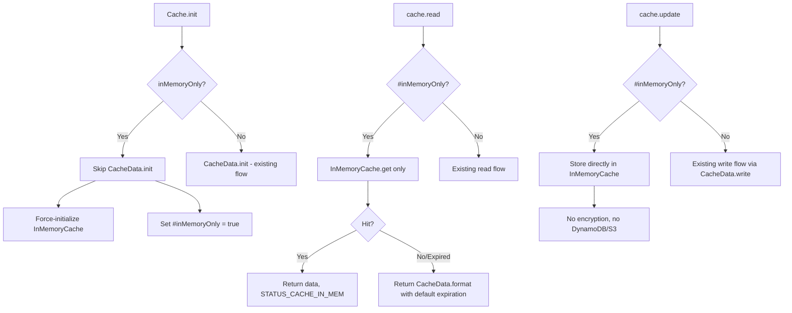

# Design Document: In-Memory Only Cache Mode

## Overview

This feature adds an `inMemoryOnly` configuration option to the Cache module that allows the entire cache system to operate without DynamoDB, S3, or encryption infrastructure. When enabled, the existing `InMemoryCache` class (L0 layer) becomes the sole storage mechanism for all cache reads and writes.

The design uses guard clauses at key decision points in the initialization and data flow paths, minimizing changes to existing code and preserving backwards compatibility for all users who do not opt in.

### Design Rationale

The primary design decision is to intercept the flow at the `Cache` class level rather than modifying `CacheData`, `DynamoDbCache`, or `S3Cache`. This approach:

1. Keeps changes localized to the public API layer
2. Avoids modifying private classes that have complex initialization requirements
3. Makes the feature easy to reason about — a single flag gates all behavior
4. Preserves the existing code paths completely untouched when the flag is off

## Architecture



### Initialization Flow (Memory-Only Mode)

1. `Cache.init(parameters)` is called with `inMemoryOnly: true` (or env var `CACHE_IN_MEMORY_ONLY`)
2. The `#inMemoryOnly` static flag is set to `true`
3. `#useInMemoryCache` is forced to `true`
4. `InMemoryCache` is instantiated (with optional sizing parameters)
5. `CacheData.init()` is **skipped entirely** — no secureDataKey, DynamoDB, or S3 required
6. A debug-level log message is emitted indicating memory-only mode

### Read Flow (Memory-Only Mode)

1. `cache.read()` checks `Cache.#inMemoryOnly`
2. If true, checks `InMemoryCache.get(idHash)`
3. On hit (cache === 1): sets `#store` and `#status = STATUS_CACHE_IN_MEM`, resolves
4. On expired (cache === -1): treats as miss (no stale fallback since there's no remote to fail)
5. On miss (cache === 0): sets `#store = CacheData.format(syncedLater)`, `#status = STATUS_NO_CACHE`, resolves
6. **Never calls** `CacheData.read()`, DynamoDB, or S3

### Write Flow (Memory-Only Mode)

1. `cache.update()` checks `Cache.#inMemoryOnly`
2. If true, formats the data into `CacheDataFormat` structure directly (no encryption)
3. Stores in `InMemoryCache.set(idHash, formattedData, expiresAtMs)`
4. Sets `#store` and appropriate `#status`
5. **Never calls** `CacheData.write()`, DynamoDB, or S3

## Components and Interfaces

### Modified: `Cache` class (static members)

New static fields:
```javascript
static #inMemoryOnly = false;  // New flag for in-memory-only mode
```

Modified methods:

| Method | Change |
|--------|--------|
| `Cache.init(parameters)` | Add guard clause before `CacheData.init()` call; resolve `inMemoryOnly` from parameter or env var; force InMemoryCache initialization when active |
| `Cache.info()` | Add `inMemoryOnly` property to returned object |

### Modified: `Cache` class (instance members)

Modified methods:

| Method | Change |
|--------|--------|
| `cache.read()` | Add early-return guard clause when `#inMemoryOnly` is true — only check InMemoryCache |
| `cache.update()` | Add early-return guard clause when `#inMemoryOnly` is true — store directly in InMemoryCache without calling CacheData.write() |

### Unchanged Classes

| Class | Reason |
|-------|--------|
| `InMemoryCache` | Already supports get/set/clear with expiration — no changes needed |
| `CacheData` | Not called in memory-only mode; no modifications required |
| `DynamoDbCache` | Not called in memory-only mode; no modifications required |
| `S3Cache` | Not called in memory-only mode; no modifications required |
| `CacheableDataAccess` | Works through `Cache` instance methods — automatically benefits from guard clauses |

### Interface: `Cache.init()` Parameters (Extended)

```javascript
/**
 * @param {Object} parameters
 * @param {boolean} [parameters.inMemoryOnly=false] Enable in-memory-only mode (no DynamoDB/S3/encryption)
 * // ... existing parameters remain unchanged
 */
```

### Interface: `Cache.info()` Return (Extended)

```javascript
{
  // ... existing properties
  inMemoryOnly: boolean,        // New: whether in-memory-only mode is active
  useInMemoryCache: boolean,    // Existing
  inMemoryCache: Object|undefined  // Existing (always present when inMemoryOnly is true)
}
```

## Data Models

### CacheDataFormat (Unchanged)

The existing `CacheDataFormat` structure is used for all cache storage, including in-memory-only mode:

```javascript
/**
 * @typedef CacheDataFormat
 * @property {Object} cache
 * @property {string|null} cache.body
 * @property {Object|null} cache.headers
 * @property {number|null} cache.expires
 * @property {string|null} cache.statusCode
 */
```

In memory-only mode, data is stored in this same format within `InMemoryCache`, ensuring that all downstream consumers (getBody(), getHeaders(), getExpires(), etc.) work identically regardless of mode.

### InMemoryCache Entry Format (Unchanged)

```javascript
// InMemoryCache stores entries as:
{ value: CacheDataFormat, expiresAt: number }  // expiresAt in milliseconds
```

### Configuration Resolution Order

| Setting | Priority 1 (Highest) | Priority 2 | Priority 3 (Default) |
|---------|---------------------|------------|---------------------|
| `inMemoryOnly` | `parameters.inMemoryOnly` | `process.env.CACHE_IN_MEMORY_ONLY` | `false` |

The `Cache.bool()` utility is used for type coercion, supporting `true`, `"true"`, `"1"`, `1` as truthy values.

## Correctness Properties

*A property is a characteristic or behavior that should hold true across all valid executions of a system — essentially, a formal statement about what the system should do. Properties serve as the bridge between human-readable specifications and machine-verifiable correctness guarantees.*

### Property 1: Relaxed Initialization in Memory-Only Mode

*For any* set of init parameters where `inMemoryOnly` is true, `Cache.init()` SHALL succeed without throwing, regardless of whether `secureDataKey`, `dynamoDbTable`, or `s3Bucket` are provided.

**Validates: Requirements 2.1, 2.2, 2.3, 2.4, 2.5, 2.6**

### Property 2: Read/Write Round-Trip via InMemoryCache

*For any* valid cache data (body string, headers object, status code, expiration), when written to the cache in memory-only mode and then read back using the same connection object, the returned data SHALL contain the same body, headers, and status code — without any encryption or external storage calls.

**Validates: Requirements 3.1, 3.2, 3.3, 4.1, 4.2, 4.3**

### Property 3: Cache Miss Returns Empty Format

*For any* connection object that has not been previously written to, reading from the cache in memory-only mode SHALL return a `CacheDataFormat` object with `body === null`, `headers === null`, and `statusCode === null`.

**Validates: Requirements 3.4**

### Property 4: Backwards Compatibility — secureDataKey Required Without inMemoryOnly

*For any* set of init parameters where `inMemoryOnly` is not set (or is false) and `secureDataKey` is absent, `Cache.init()` SHALL throw an error, preserving the existing initialization requirements.

**Validates: Requirements 1.4, 7.1, 7.3, 7.4**

### Property 5: Expiration Is Respected in Memory-Only Mode

*For any* cache entry written with a specific expiration timestamp, reading from the cache after that timestamp has passed SHALL return a cache miss (empty format), demonstrating that the InMemoryCache expiration mechanism is properly utilized.

**Validates: Requirements 4.4, 8.3**

## Error Handling

### Initialization Errors

| Scenario | Behavior |
|----------|----------|
| `inMemoryOnly` is truthy but InMemoryCache fails to construct | Throw error (fatal — cannot operate without storage) |
| `inMemoryOnly` is falsy and `secureDataKey` missing | Throw error (existing behavior preserved) |
| `parameters` is null or not an object | Throw error (existing behavior preserved) |

### Runtime Errors

| Scenario | Behavior |
|----------|----------|
| InMemoryCache.get() returns unexpected value | Return empty format, log error |
| InMemoryCache.set() fails (shouldn't happen with Map) | Log error, continue (data not cached but operation succeeds) |

### Logging

| Event | Level | Message |
|-------|-------|---------|
| Memory-only mode activated | DEBUG | "In-memory only cache mode activated. No DynamoDB/S3 persistence." |
| Read hit in memory-only mode | DEBUG | "In-memory cache hit: {idHash}" |
| Read miss in memory-only mode | DEBUG | "In-memory cache miss: {idHash}" |
| Write in memory-only mode | DEBUG | "Stored in in-memory cache (memory-only mode): {idHash}" |

## Testing Strategy

### Property-Based Tests (fast-check)

Each correctness property above will be implemented as a property-based test using `fast-check` with a minimum of 100 iterations per property. Tests will use subprocess isolation where `Cache.init()` needs to be called fresh (since it's a static singleton).

**Test file**: `test/cache/in-memory-only/property/in-memory-only-property-tests.jest.mjs`

**Configuration**:
- Library: fast-check (already in devDependencies)
- Minimum iterations: 100
- Each test tagged with: `Feature: 1-3-14-in-memory-only-cache-mode, Property {N}: {title}`

**Generators needed**:
- `arbCacheBody`: Arbitrary non-empty strings for cache body content
- `arbHeaders`: Arbitrary objects with string keys/values for headers
- `arbStatusCode`: Arbitrary valid HTTP status codes as strings
- `arbExpiration`: Arbitrary future timestamps (seconds)
- `arbConnection`: Arbitrary connection objects with host/path

### Unit Tests (Jest)

**Test file**: `test/cache/in-memory-only/unit/in-memory-only-unit-tests.jest.mjs`

Cover specific examples and edge cases:
- `inMemoryOnly: true` activates mode
- `inMemoryOnly: "true"` and `"1"` activate mode via Cache.bool()
- Environment variable `CACHE_IN_MEMORY_ONLY` fallback (subprocess isolation)
- Parameter takes precedence over env var (subprocess isolation)
- `Cache.info()` includes `inMemoryOnly` property
- `useInMemoryCache: false` is overridden by `inMemoryOnly: true`
- InMemoryCache configuration parameters are passed through
- Debug log message emitted on activation

### Integration Tests (Jest)

**Test file**: `test/cache/in-memory-only/integration/in-memory-only-integration-tests.jest.mjs`

Cover end-to-end flows:
- `CacheableDataAccess.getData()` full flow in memory-only mode (miss → fetch → store → hit)
- Cache expiration and refresh cycle in memory-only mode
- Multiple Cache instances sharing the same InMemoryCache in memory-only mode
- `extendExpires()` behavior in memory-only mode

### Test Isolation

Since `Cache.init()` is a static singleton that can only be called once per process, tests requiring different initialization configurations MUST use subprocess isolation (as documented in the test-requirements steering file).

### Mocking Strategy

For property-based tests that need to verify no external calls are made:
- Spy on `CacheData.read` and `CacheData.write` via `TestHarness.getInternals()`
- Verify they are never called in memory-only mode
- Use `jest.spyOn(tools.default.AWS, 'dynamo', 'get')` to verify no DynamoDB calls
