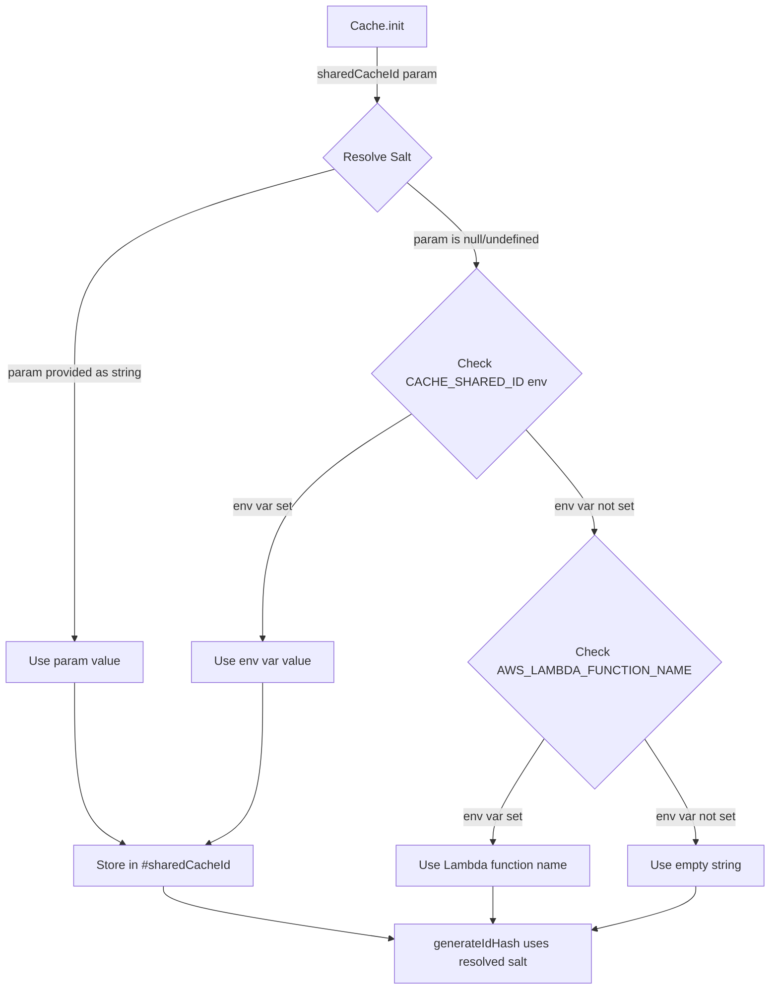

# Design Document: Shared Cache Identifier

## Overview

This design adds a `sharedCacheId` parameter to `Cache.init()` that allows multiple Lambda functions to share cached data by overriding the default per-function salt used in cache key hash generation.

Currently, `Cache.generateIdHash()` uses `process.env.AWS_LAMBDA_FUNCTION_NAME` as the salt when computing cache keys. This means two Lambda functions fetching the same data from the same endpoint produce different cache key hashes and store separate entries in DynamoDB/S3. The `sharedCacheId` parameter provides a clean, opt-in mechanism for functions to share cache entries without overriding AWS-managed environment variables.

### Design Decisions

1. **Static private field**: `#sharedCacheId` is stored as a static private field on the `Cache` class, consistent with `#idHashAlgorithm` and `#useToolsHash`.
2. **Priority chain**: The salt resolution follows the established pattern in this codebase (parameter → env var → default), matching how `idHashAlgorithm`, `dynamoDbTable`, and other settings are resolved.
3. **Null semantics**: `null` in `info()` means "not configured" (using default Lambda function name), consistent with how other optional fields are reported.
4. **Empty string is valid**: An empty string explicitly means "no salt", which is a valid use case for cross-account or cross-function sharing where no namespace isolation is desired.

## Architecture

The change is minimal and localized to the `Cache` class in `src/lib/dao-cache.js`:



The salt resolution happens at `init()` time for the `sharedCacheId` parameter and `CACHE_SHARED_ID` env var. The fallback to `AWS_LAMBDA_FUNCTION_NAME` happens at `generateIdHash()` call time (as it does today) to handle cases where the env var might not be available at init time.

## Components and Interfaces

### Modified: `Cache` class (`src/lib/dao-cache.js`)

#### New Private Static Field

```javascript
static #sharedCacheId = null; // null means "not configured"
```

#### Modified: `Cache.init(parameters)`

Accepts new optional `sharedCacheId` property in the parameters object. Validates the value and stores it.

```javascript
// After existing parameter validation
if ("sharedCacheId" in parameters && parameters.sharedCacheId !== null && parameters.sharedCacheId !== undefined) {
    if (typeof parameters.sharedCacheId !== "string") {
        throw new Error("Cache.init() sharedCacheId must be a string, null, or undefined");
    }
    this.#sharedCacheId = parameters.sharedCacheId;
} else if (process.env.CACHE_SHARED_ID !== undefined) {
    this.#sharedCacheId = process.env.CACHE_SHARED_ID;
}
```

#### Modified: `Cache.generateIdHash(idObject)`

Replace the current salt resolution:

```javascript
// Current:
const salt = process.env?.AWS_LAMBDA_FUNCTION_NAME || "";

// New:
const salt = this.#sharedCacheId !== null
    ? this.#sharedCacheId
    : (process.env?.AWS_LAMBDA_FUNCTION_NAME || "");
```

#### Modified: `Cache.info()`

Add `sharedCacheId` to the returned object:

```javascript
info.sharedCacheId = this.#sharedCacheId; // null if not configured
```

### Modified: TypeScript Definitions (`types/lib/dao-cache.d.ts`)

#### `CacheInitParameters` interface

```typescript
/** Optional shared cache identifier to override the default Lambda function name salt.
 * When set, all functions using the same sharedCacheId produce identical cache hashes
 * for the same request. Env: CACHE_SHARED_ID */
sharedCacheId?: string;
```

#### `Cache.info()` return type

Add to the return type:

```typescript
sharedCacheId: string | null;
```

### Modified: Documentation (`docs/features/cache/README.md`)

- Add `sharedCacheId` to the Configuration Options table
- Add `CACHE_SHARED_ID` to the environment variables section
- Add a "Shared Cache" usage section with examples
- Add a warning about shared expiration semantics

## Data Models

No new data models are introduced. The change only affects how the salt value is determined when computing cache key hashes. The DynamoDB and S3 storage format remains unchanged.

### Salt Resolution Priority

| Priority | Source | Condition |
|----------|--------|-----------|
| 1 (highest) | `sharedCacheId` parameter | String value provided in `Cache.init()` |
| 2 | `CACHE_SHARED_ID` env var | Parameter not provided, env var is set |
| 3 | `AWS_LAMBDA_FUNCTION_NAME` env var | Neither parameter nor `CACHE_SHARED_ID` set |
| 4 (lowest) | Empty string `""` | None of the above are available |

## Correctness Properties

*A property is a characteristic or behavior that should hold true across all valid executions of a system — essentially, a formal statement about what the system should do. Properties serve as the bridge between human-readable specifications and machine-verifiable correctness guarantees.*

### Property 1: Same sharedCacheId produces identical hashes

*For any* valid connection object and any string value S, two Cache instances both initialized with `sharedCacheId: S` SHALL produce identical hash values from `generateIdHash()` when given the same connection object.

**Validates: Requirements 3.1**

### Property 2: Different sharedCacheId produces different hashes

*For any* valid connection object and any two distinct string values S1 and S2, Cache instances initialized with `sharedCacheId: S1` and `sharedCacheId: S2` respectively SHALL produce different hash values from `generateIdHash()` when given the same connection object.

**Validates: Requirements 3.2**

### Property 3: Parameter takes priority over environment variable

*For any* string values P and E where P ≠ E, when `sharedCacheId` parameter is set to P and `CACHE_SHARED_ID` environment variable is set to E, the effective salt used in `generateIdHash()` SHALL be P (the parameter value).

**Validates: Requirements 2.1, 2.2**

### Property 4: Backwards compatibility — no sharedCacheId preserves existing behavior

*For any* valid connection object, when `sharedCacheId` is not provided and `CACHE_SHARED_ID` is not set, `generateIdHash()` SHALL produce the same hash as the current implementation (using `AWS_LAMBDA_FUNCTION_NAME` as salt).

**Validates: Requirements 5.1**

### Property 5: Invalid types are rejected

*For any* value that is not a string, null, or undefined (e.g., numbers, objects, arrays, booleans), passing it as `sharedCacheId` to `Cache.init()` SHALL throw an Error.

**Validates: Requirements 6.1**

### Property 6: Null and undefined fall through to environment variable

*For any* `sharedCacheId` value of `null` or `undefined`, the Cache SHALL treat it as not provided and resolve the salt from `CACHE_SHARED_ID` env var or `AWS_LAMBDA_FUNCTION_NAME`.

**Validates: Requirements 6.2**

## Error Handling

### Validation Errors

| Condition | Behavior | Error Message |
|-----------|----------|---------------|
| `sharedCacheId` is a number | Throw `Error` during `init()` | `"Cache.init() sharedCacheId must be a string, null, or undefined"` |
| `sharedCacheId` is an object | Throw `Error` during `init()` | `"Cache.init() sharedCacheId must be a string, null, or undefined"` |
| `sharedCacheId` is an array | Throw `Error` during `init()` | `"Cache.init() sharedCacheId must be a string, null, or undefined"` |
| `sharedCacheId` is a boolean | Throw `Error` during `init()` | `"Cache.init() sharedCacheId must be a string, null, or undefined"` |

### Non-Error Cases

| Condition | Behavior |
|-----------|----------|
| `sharedCacheId` is `null` | Treated as not provided, fall through to env var/default |
| `sharedCacheId` is `undefined` | Treated as not provided, fall through to env var/default |
| `sharedCacheId` is empty string `""` | Valid — uses empty string as salt (no namespace isolation) |
| `sharedCacheId` contains special characters | Valid — any string is accepted |
| `sharedCacheId` contains whitespace | Valid — any string is accepted |

## Testing Strategy

### Property-Based Tests (fast-check)

Property-based testing is appropriate for this feature because:
- The core logic involves deterministic hash generation with varying inputs
- Universal properties (same input → same output, different input → different output) hold across all valid inputs
- The input space (arbitrary strings, connection objects) is large

**Library**: fast-check (already in devDependencies)
**Minimum iterations**: 100 per property test
**Tag format**: `Feature: shared-cache-identifier, Property {number}: {property_text}`

Each correctness property above will be implemented as a single property-based test.

### Unit Tests (Jest)

Unit tests will cover:
- `Cache.init()` validation: invalid types throw errors
- `Cache.init()` with `sharedCacheId` parameter stores the value
- `Cache.init()` with `CACHE_SHARED_ID` env var uses the env var
- `Cache.init()` priority: parameter wins over env var
- `Cache.info()` returns `sharedCacheId` value or `null`
- `generateIdHash()` uses the configured salt
- Empty string as valid `sharedCacheId`
- `null` and `undefined` treated as not provided

### Test Isolation

Since `Cache.init()` can only be called once (singleton pattern), property tests that need different `sharedCacheId` values will use subprocess isolation (`execSync` with direct Jest binary invocation) for validation tests, consistent with the existing pattern in `cache-validation-tests.jest.mjs`.

For hash determinism tests, we can test `generateIdHash()` behavior by examining the salt resolution logic through the TestHarness pattern or by comparing hashes across multiple calls with the same configuration.
