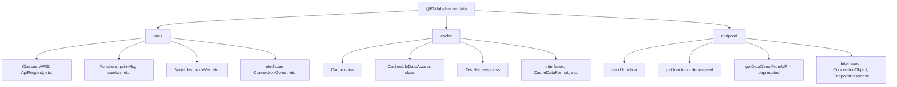
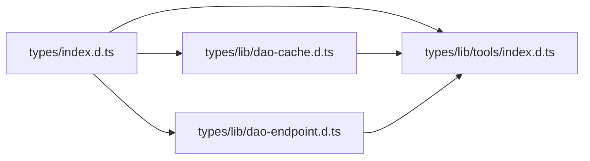

# Design Document: TypeScript Type Definitions

## Overview

This feature adds TypeScript declaration files (`.d.ts`) to the @63klabs/cache-data package so that consumers get IntelliSense support without converting the source code to TypeScript. The declaration files describe the public API surface — classes, functions, interfaces, and type aliases — and are shipped alongside the JavaScript source.

The approach uses hand-written declaration files (not auto-generated from JSDoc) to ensure precise control over the type surface, proper handling of CommonJS module patterns, and high-quality documentation in the type definitions.

## Architecture

### File Organization

Declaration files will be placed in a dedicated `types/` directory at the project root, mirroring the source structure:

```
types/
├── index.d.ts              ← Main declaration file (package.json "types" points here)
├── lib/
│   ├── dao-cache.d.ts      ← Cache module types
│   ├── dao-endpoint.d.ts   ← Endpoint module types
│   └── tools/
│       └── index.d.ts      ← Tools module types
```

**Rationale:** A dedicated `types/` directory keeps declaration files separate from source code, avoids cluttering the `src/` directory, and makes it clear which files are type definitions vs. implementation. This is a common pattern for JavaScript packages that add types retroactively (e.g., `aws-sdk`).

### Module Declaration Approach

Since this is a CommonJS package, the declaration files will use the `export =` pattern combined with namespace declarations to model the `module.exports` structure:

```typescript
// types/index.d.ts
import tools = require("./lib/tools/index");
import cache = require("./lib/dao-cache");
import endpoint = require("./lib/dao-endpoint");

export { tools, cache, endpoint };
```

Each sub-module declaration file will use `export =` or named exports as appropriate for its CommonJS export shape.

### package.json Configuration

```json
{
  "types": "types/index.d.ts"
}
```

### TypeScript Compatibility

- Target: TypeScript 4.5+ (supports `import ... = require(...)` syntax)
- No use of newer TS features that would break 4.5 compatibility (e.g., no `satisfies`, no `const` type parameters)
- Uses `esModuleInterop`-compatible patterns

## Components and Interfaces

### Main Entry Point (`types/index.d.ts`)

Declares the top-level module structure matching `src/index.js`:

```typescript
import tools = require("./lib/tools/index");
import cache = require("./lib/dao-cache");
import endpoint = require("./lib/dao-endpoint");

export { tools, cache, endpoint };
```

### Tools Module (`types/lib/tools/index.d.ts`)

Declares all public exports from `src/lib/tools/index.js`:

**Classes (18):**
- `AWS`, `AWSXRay`, `ApiRequest`, `ImmutableObject`, `Timer`, `DebugAndLog`
- `Connection`, `Connections`, `ConnectionRequest`, `ConnectionAuthentication`
- `RequestInfo`, `ClientRequest`, `ResponseDataModel`, `Response`
- `AppConfig`, `CachedSsmParameter`, `CachedSecret`, `CachedParameterSecret`, `CachedParameterSecrets`

**Functions (4):**
- `printMsg`, `sanitize`, `obfuscate`, `hashThisData`

**Variables (4):**
- `nodeVer`, `nodeVerMajor`, `nodeVerMinor`, `nodeVerMajorMinor`

**Generic Response Modules (5):**
- `jsonGenericResponse`, `htmlGenericResponse`, `rssGenericResponse`, `xmlGenericResponse`, `textGenericResponse`

**Deprecated Aliases (5):**
- `Aws` → `AWS`
- `AwsXRay` → `AWSXRay`
- `APIRequest` → `ApiRequest`
- `_ConfigSuperClass` → `AppConfig`
- `CachedSSMParameter` → `CachedSsmParameter`

### Cache Module (`types/lib/dao-cache.d.ts`)

Declares public exports from `src/lib/dao-cache.js`:

**Classes:**
- `Cache` — Static class with `init()`, `info()`, `bool()`, `generateIdHash()`, instance methods for cache operations
- `CacheableDataAccess` — Static class with `getData()` and `prime()`
- `TestHarness` — Testing utility with `getInternals()`

**Interfaces:**
- `CacheDataFormat` — Shape of cached data objects
- `CacheInitParameters` — Parameters for `Cache.init()`
- `CacheProfileObject` — Cache profile configuration

### Endpoint Module (`types/lib/dao-endpoint.d.ts`)

Declares public exports from `src/lib/dao-endpoint.js`:

**Functions:**
- `send(connection, query?)` — Primary endpoint request function
- `get(connection, query?)` — Deprecated alias
- `getDataDirectFromURI(connection, query?)` — Deprecated alias

**Interfaces:**
- `ConnectionObject` — Connection configuration for endpoint requests
- `EndpointResponse` — Response shape from endpoint calls

### Shared Interfaces

Key interfaces that appear across modules:

```typescript
interface ConnectionObject {
  method?: string;
  uri?: string;
  protocol?: string;
  host?: string;
  path?: string;
  parameters?: Record<string, string | number | boolean> | null;
  headers?: Record<string, string> | null;
  body?: string | null;
  note?: string;
  options?: { timeout?: number } | null;
  cache?: CacheProfileObject[];
}

interface CacheProfileObject {
  profile?: string;
  overrideOriginHeaderExpiration?: boolean;
  defaultExpirationInSeconds?: number;
  expirationIsOnInterval?: boolean;
  headersToRetain?: string[] | string;
  hostId?: string;
  pathId?: string;
  encrypt?: boolean;
  defaultExpirationExtensionOnErrorInSeconds?: number;
}

interface CacheDataFormat {
  cache: {
    body: string;
    headers: Record<string, string>;
    expires: number;
    statusCode: string;
  };
}

interface EndpointResponse {
  success: boolean;
  statusCode: number;
  body: object | string | null;
  headers: Record<string, string>;
}
```

### AppConfig Extensibility

The `AppConfig` class declaration will be structured to support inheritance:

```typescript
declare class AppConfig {
  static init(options?: AppConfigInitOptions): boolean;
  static add(promise: Promise<any>): void;
  static settings(): object | null;
  static connections(): Connections | null;
  static getConnection(name: string): Connection | null;
  static getConn(name: string): ConnectionObject | null;
  static getConnCacheProfile(connectionName: string, cacheProfileName: string): {
    conn: ConnectionObject | null;
    cacheProfile: CacheProfileObject | null;
  };
  static promise(): Promise<any[]>;
}

interface AppConfigInitOptions {
  settings?: object;
  connections?: object;
  validations?: object;
  responses?: {
    settings?: {
      errorExpirationInSeconds?: number;
      routeExpirationInSeconds?: number;
      externalRequestHeadroomInMs?: number;
    };
    jsonResponses?: object;
    htmlResponses?: object;
    xmlResponses?: object;
    rssResponses?: object;
    textResponses?: object;
  };
  ssmParameters?: object;
  debug?: boolean;
}
```

## Data Models

### Type Hierarchy



### Declaration File Dependency Graph



The cache and endpoint modules reference types from the tools module (e.g., `ConnectionObject`, `Connections`, `Connection`).

## Correctness Properties

*A property is a characteristic or behavior that should hold true across all valid executions of a system — essentially, a formal statement about what the system should do. Properties serve as the bridge between human-readable specifications and machine-verifiable correctness guarantees.*

### Property 1: Public Export Type Coverage

*For any* public export (class, function, or variable) listed in `src/lib/tools/index.js`, `src/lib/dao-cache.js`, or `src/lib/dao-endpoint.js`, there SHALL exist a corresponding type declaration in the appropriate `.d.ts` file that allows a TypeScript consumer to reference it without compilation errors.

**Validates: Requirements 2.1, 2.2, 2.3, 2.4, 3.1, 4.1**

### Property 2: Deprecated Export Annotation Coverage

*For any* export marked as deprecated in the source code (via JSDoc `@deprecated` or comment), the corresponding declaration in the `.d.ts` file SHALL include a `@deprecated` JSDoc annotation.

**Validates: Requirements 5.1, 5.2**

### Property 3: Interface Property Completeness

*For any* property specified in the requirements for `ConnectionObject`, `CacheProfileObject`, or `CacheDataFormat` interfaces, the corresponding TypeScript interface declaration SHALL include that property with an appropriate type, and a TypeScript consumer accessing that property SHALL compile without errors.

**Validates: Requirements 6.1, 6.2, 6.3**

### Property 4: Declaration File Validity (No Implementation Code)

*For any* `.d.ts` file in the `types/` directory, the file SHALL contain only TypeScript declaration syntax (type annotations, interfaces, class declarations without method bodies) and SHALL NOT contain executable implementation code (function bodies, variable assignments with runtime values, import of runtime modules).

**Validates: Requirements 7.1, 7.2**

### Property 5: JSDoc Documentation Completeness

*For any* public class, method, or function declared in the `.d.ts` files, there SHALL exist a JSDoc comment block. For methods with parameters, the JSDoc SHALL include `@param` tags. For methods with non-void return types, the JSDoc SHALL include a `@returns` tag.

**Validates: Requirements 10.1, 10.2, 10.3**

## Error Handling

### Type Validation Errors

If the declaration files contain syntax errors or type inconsistencies, `tsc --noEmit` will report them. The validation script will:
1. Run `tsc --noEmit` against the declaration files
2. Run `tsc --noEmit` against a test consumer project that exercises the public API
3. Report any errors with file location and description

### Graceful Degradation

If a consumer uses an older TypeScript version (< 4.5), the types may not resolve correctly. The declaration files will avoid features introduced after TS 4.5 to maximize compatibility. If a consumer's `tsconfig.json` has strict settings that conflict, the types should still work — optional properties use `?` syntax and nullable types use `| null` unions.

### Missing Type Information

For complex internal types that are difficult to express precisely (e.g., the AWS SDK wrapper return types), the declarations will use `any` or broad types rather than incorrect narrow types. This ensures consumers don't get false type errors while still getting IntelliSense for the parts that are well-typed.

## Testing Strategy

### Validation Approach

Since this feature produces static declaration files (not runtime code), property-based testing with randomized inputs is not the primary validation mechanism. Instead, the testing strategy uses:

1. **Type Checker Validation** (`tsc --noEmit`): Verify declaration files are syntactically and semantically valid TypeScript
2. **Consumer Compilation Tests**: TypeScript files that import and use the package API, compiled with `tsc --noEmit` to verify type resolution
3. **Structural Validation**: Property-based tests that verify the declaration files contain required elements (exports, JSDoc, deprecation annotations)

### Test Structure

```
test/types/
├── tsconfig.json                    ← TypeScript config for validation
├── consumer-tools.ts                ← Test consumer for tools module
├── consumer-cache.ts                ← Test consumer for cache module
├── consumer-endpoint.ts             ← Test consumer for endpoint module
├── consumer-appconfig-extend.ts     ← Test consumer for AppConfig extensibility
└── property/
    └── type-definitions-property-tests.jest.mjs  ← Property-based structural tests
```

### Property-Based Tests (fast-check)

Property-based tests will validate structural properties of the declaration files:

- **Property 1 (Export Coverage)**: For each known public export, verify a corresponding declaration exists in the .d.ts file
- **Property 2 (Deprecated Annotations)**: For each known deprecated export, verify `@deprecated` appears in the .d.ts file
- **Property 3 (Interface Properties)**: For each specified interface property, verify it exists in the declaration
- **Property 4 (No Implementation)**: For each .d.ts file, verify no implementation patterns exist
- **Property 5 (JSDoc Completeness)**: For each declared class/method, verify JSDoc tags exist

**Configuration:**
- Minimum 100 iterations per property test
- Tag format: `Feature: typescript-type-definitions, Property {N}: {description}`
- Library: fast-check (already in devDependencies)

### Integration Tests

- Run `tsc --noEmit` on consumer test files to verify end-to-end type resolution
- Verify `package.json` types field points to an existing file
- Verify `.npmignore` does not exclude the `types/` directory

### Unit Tests

- Verify each consumer file compiles independently
- Verify AppConfig extensibility pattern works
- Verify deprecated exports show proper annotations
