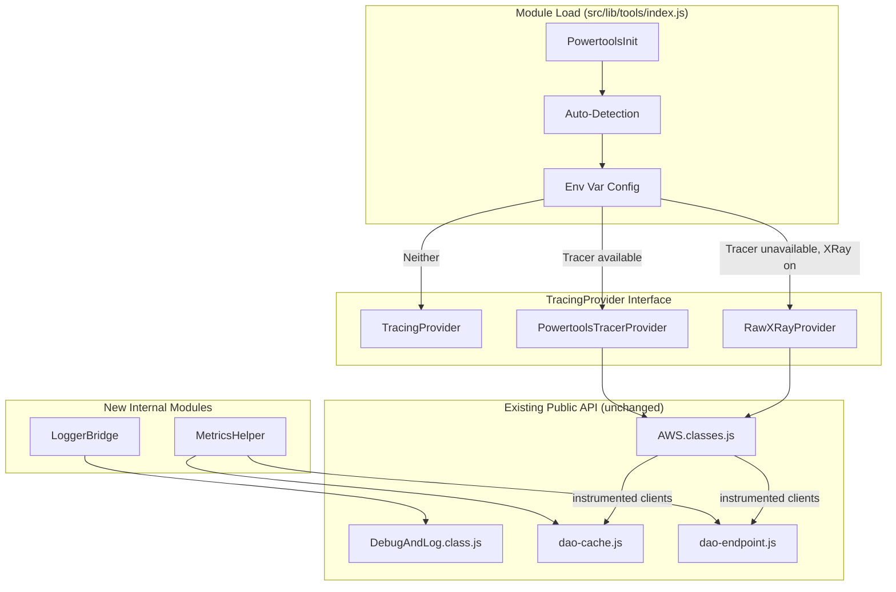
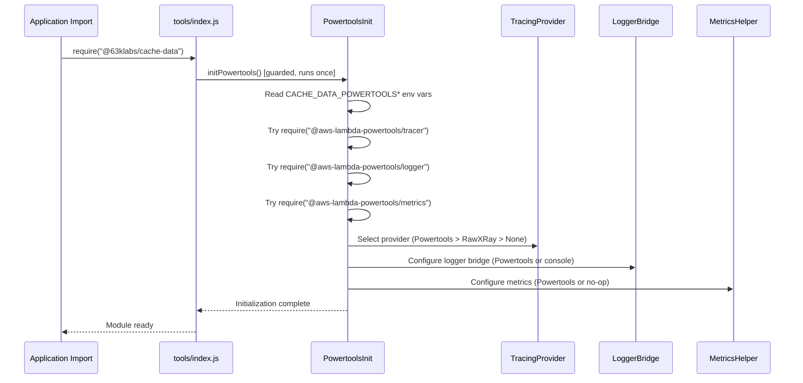

# Design Document: Powertools Integration

## Overview

This design integrates AWS Lambda Powertools for TypeScript (v2.x) into the @63klabs/cache-data package as a transparent backend enhancement. When Powertools packages are installed by the user, the existing public API automatically gains structured JSON logging, enhanced X-Ray tracing with custom subsegments, and CloudWatch EMF metrics — all without code changes or breaking existing behavior.

The integration follows Option A (Powertools as Backend for Existing API), using the same opt-in pattern established by the existing X-Ray integration: environment-variable-driven, lazy-loaded at module import, and zero-cost when disabled or absent.

### Key Design Decisions

1. **TracingProvider interface** abstracts tracing so cache/endpoint code doesn't duplicate logic for raw X-Ray vs Powertools Tracer
2. **Auto-detection at module load** mirrors the existing `initializeXRay()` pattern — a guarded function that runs once
3. **Powertools takes precedence** over raw X-Ray when both are available, preventing double-instrumentation
4. **Optional peer dependencies** keep bundle size unchanged for users who don't opt in
5. **DebugAndLog delegates** to Powertools Logger when available, switching output from plain text to structured JSON

## Architecture

### High-Level System Diagram



### Initialization Sequence



### Tracer Precedence Flow

```mermaid
flowchart TD
    A[Module Load] --> B{CACHE_DATA_POWERTOOLS disabled?}
    B -->|Yes| C[All Powertools disabled]
    B -->|No| D{@aws-lambda-powertools/tracer importable?}
    D -->|Yes| E{CACHE_DATA_POWERTOOLS_TRACER disabled?}
    E -->|Yes| F{CacheData_AWSXRayOn true?}
    E -->|No| G[Use PowertoolsTracerProvider]
    D -->|No| F
    F -->|Yes| H[Use RawXRayProvider]
    F -->|No| I[No tracing]
    C --> I
```

## Components and Interfaces

### 1. PowertoolsInit Module

**File:** `src/lib/tools/PowertoolsInit.js`

Responsible for auto-detection, environment variable parsing, and initialization orchestration.

```javascript
/**
 * Powertools initialization state and detection results.
 * @private
 */
let powertoolsInitialized = false;

const powertoolsState = {
    tracer: { available: false, enabled: false, instance: null },
    logger: { available: false, enabled: false, instance: null },
    metrics: { available: false, enabled: false, instance: null }
};

/**
 * Parse a Powertools environment variable value into a boolean decision.
 * "0", "false", "no" (case-insensitive) → disabled
 * "1", "true", "yes" (case-insensitive) → enabled
 * Unset or empty → unset (null)
 * Any other value → enabled
 * 
 * @param {string|undefined} value - The environment variable value
 * @returns {boolean|null} true=enabled, false=disabled, null=unset
 */
function parseEnvFlag(value) {
    if (value === undefined || value === null || value === "") return null;
    const lower = value.toLowerCase();
    if (["0", "false", "no"].includes(lower)) return false;
    return true; // "1", "true", "yes", or any unrecognized value
}

/**
 * Determine if a specific capability is enabled based on env vars.
 * 
 * @param {boolean|null} globalFlag - CACHE_DATA_POWERTOOLS parsed value
 * @param {boolean|null} individualFlag - Individual capability parsed value
 * @param {boolean} isImportable - Whether the package was successfully imported
 * @returns {boolean}
 */
function isCapabilityEnabled(globalFlag, individualFlag, isImportable) {
    if (globalFlag === false) return false;
    if (individualFlag === false) return false;
    return isImportable;
}

/**
 * Initialize Powertools integration. Runs at most once.
 * Called from tools/index.js at module load time.
 * 
 * @returns {{tracer: boolean, logger: boolean, metrics: boolean}} Enabled state
 */
function initPowertools() {
    if (powertoolsInitialized) return getState();

    const globalFlag = parseEnvFlag(process.env.CACHE_DATA_POWERTOOLS);
    const tracerFlag = parseEnvFlag(process.env.CACHE_DATA_POWERTOOLS_TRACER);
    const loggerFlag = parseEnvFlag(process.env.CACHE_DATA_POWERTOOLS_LOGGER);
    const metricsFlag = parseEnvFlag(process.env.CACHE_DATA_POWERTOOLS_METRICS);

    // Attempt imports independently
    powertoolsState.tracer.available = tryImport("@aws-lambda-powertools/tracer");
    powertoolsState.logger.available = tryImport("@aws-lambda-powertools/logger");
    powertoolsState.metrics.available = tryImport("@aws-lambda-powertools/metrics");

    // Determine enabled state
    powertoolsState.tracer.enabled = isCapabilityEnabled(
        globalFlag, tracerFlag, powertoolsState.tracer.available
    );
    powertoolsState.logger.enabled = isCapabilityEnabled(
        globalFlag, loggerFlag, powertoolsState.logger.available
    );
    powertoolsState.metrics.enabled = isCapabilityEnabled(
        globalFlag, metricsFlag, powertoolsState.metrics.available
    );

    // Instantiate enabled capabilities
    if (powertoolsState.tracer.enabled) {
        initTracer();
    }
    if (powertoolsState.logger.enabled) {
        initLogger();
    }
    if (powertoolsState.metrics.enabled) {
        initMetrics();
    }

    powertoolsInitialized = true;
    return getState();
}

/**
 * Try to require a package. Returns true if successful, false otherwise.
 * @param {string} packageName
 * @returns {boolean}
 */
function tryImport(packageName) {
    try {
        require(packageName);
        return true;
    } catch {
        return false;
    }
}

/**
 * Get the current Powertools state for programmatic querying.
 * @returns {{tracer: boolean, logger: boolean, metrics: boolean}}
 */
function getState() {
    return {
        tracer: powertoolsState.tracer.enabled,
        logger: powertoolsState.logger.enabled,
        metrics: powertoolsState.metrics.enabled
    };
}
```

### 2. TracingProvider Interface

**File:** `src/lib/utils/TracingProvider.js`

```javascript
/**
 * TracingProvider interface definition.
 * Both RawXRayProvider and PowertoolsTracerProvider implement this contract.
 * 
 * @interface TracingProvider
 * @private
 */

/**
 * @typedef {Object} TracingProvider
 * @property {function(Object): Object} instrumentClient - Instrument an AWS SDK v3 client
 * @property {function(): void} captureHttp - Enable HTTP/HTTPS tracing
 * @property {function(string): void} openSubsegment - Open a named subsegment
 * @property {function(): void} closeSubsegment - Close the current subsegment
 * @property {function(Error): void} addError - Record an error on the current subsegment
 * @property {string} name - Provider name for diagnostic logging
 */

/**
 * No-op tracing provider used when tracing is disabled.
 */
class NoOpTracingProvider {
    get name() { return "none"; }
    instrumentClient(client) { return client; }
    captureHttp() {}
    openSubsegment(_name) {}
    closeSubsegment() {}
    addError(_error) {}
}

/**
 * RawXRayProvider wraps aws-xray-sdk-core directly.
 * Mirrors the existing X-Ray behavior in AWS.classes.js.
 */
class RawXRayProvider {
    #xray = null;

    constructor() {
        try {
            this.#xray = require("aws-xray-sdk-core");
        } catch (error) {
            // Logged by caller; this provider won't be selected if import fails
        }
    }

    get name() { return "raw-xray"; }

    instrumentClient(client) {
        try {
            return this.#xray.captureAWSv3Client(client);
        } catch (error) {
            console.warn(`[WARN] RawXRayProvider.instrumentClient failed: ${error.message}`);
            return client;
        }
    }

    captureHttp() {
        try {
            const captureOptions = {
                captureRequestInit: true,
                captureResponse: true,
                generateUniqueId: true
            };
            this.#xray.captureHTTPsGlobal(require("http"), captureOptions);
            this.#xray.captureHTTPsGlobal(require("https"), captureOptions);
        } catch (error) {
            console.warn(`[WARN] RawXRayProvider.captureHttp failed: ${error.message}`);
        }
    }

    openSubsegment(name) {
        try {
            const segment = this.#xray.getSegment();
            if (segment) {
                return segment.addNewSubsegment(name);
            }
        } catch (error) {
            // Subsegment operations are best-effort
        }
        return null;
    }

    closeSubsegment(subsegment) {
        try {
            if (subsegment) subsegment.close();
        } catch (error) {
            // Best-effort
        }
    }

    addError(error, subsegment) {
        try {
            if (subsegment) subsegment.addError(error);
        } catch {
            // Best-effort
        }
    }
}

/**
 * PowertoolsTracerProvider wraps @aws-lambda-powertools/tracer.
 * Provides enhanced tracing with custom subsegments, annotations, and metadata.
 */
class PowertoolsTracerProvider {
    #tracer = null;

    constructor(serviceName) {
        try {
            const { Tracer } = require("@aws-lambda-powertools/tracer");
            this.#tracer = new Tracer({ serviceName });
        } catch (error) {
            // Logged by caller
        }
    }

    get name() { return "powertools-tracer"; }
    get instance() { return this.#tracer; }

    instrumentClient(client) {
        try {
            return this.#tracer.captureAWSv3Client(client);
        } catch (error) {
            console.warn(`[WARN] PowertoolsTracerProvider.instrumentClient failed: ${error.message}`);
            return client;
        }
    }

    captureHttp() {
        // Powertools Tracer captures HTTP automatically when provider is active
        // No explicit captureHTTPsGlobal needed
    }

    openSubsegment(name) {
        try {
            const subsegment = this.#tracer.getSegment().addNewSubsegment(name);
            this.#tracer.setSegment(subsegment);
            return subsegment;
        } catch (error) {
            return null;
        }
    }

    closeSubsegment(subsegment) {
        try {
            if (subsegment) {
                subsegment.close();
                this.#tracer.setSegment(subsegment.parent);
            }
        } catch {
            // Best-effort
        }
    }

    addError(error, subsegment) {
        try {
            if (subsegment) {
                subsegment.addError(error);
            }
        } catch {
            // Best-effort
        }
    }
}

module.exports = {
    NoOpTracingProvider,
    RawXRayProvider,
    PowertoolsTracerProvider
};
```

### 3. LoggerBridge Module

**File:** `src/lib/utils/LoggerBridge.js`

Bridges DebugAndLog to Powertools Logger when available.

```javascript
/**
 * LoggerBridge provides the delegation layer between DebugAndLog and
 * Powertools Logger. When Logger is available, it outputs structured JSON.
 * When absent, it returns null and DebugAndLog falls back to console.
 * 
 * @private
 */
class LoggerBridge {
    #logger = null;
    #coldStart = true;

    constructor(serviceName) {
        try {
            const { Logger } = require("@aws-lambda-powertools/logger");
            this.#logger = new Logger({ serviceName });
        } catch {
            // Logger not available
        }
    }

    get isActive() { return this.#logger !== null; }
    get instance() { return this.#logger; }

    /**
     * Inject Lambda context for enrichment.
     * @param {Object} context - Lambda context object
     */
    addContext(context) {
        if (this.#logger && context) {
            this.#logger.addContext(context);
        }
    }

    /**
     * Log a message at the specified level with optional additional data.
     * 
     * @param {string} level - Powertools log level (error, warn, info, debug)
     * @param {string} message - Log message
     * @param {Object|null} obj - Additional data to include
     */
    log(level, message, obj = null) {
        if (!this.#logger) return;

        const extra = {};
        if (obj !== null) {
            extra.details = obj;
        }

        // Add X-Ray trace ID if available
        const traceId = process.env._X_AMZN_TRACE_ID || null;
        if (traceId) {
            extra.xray_trace_id = traceId;
        }

        this.#logger[level](message, extra);
    }

    /**
     * Map DebugAndLog tag to Powertools Logger level.
     * ERROR → error, WARN → warn, INFO → info, MSG → info, DIAG → debug, DEBUG → debug
     * 
     * @param {string} tag - DebugAndLog tag
     * @returns {string} Powertools Logger level
     */
    static mapLevel(tag) {
        const map = {
            "ERROR": "error",
            "WARN": "warn",
            "INFO": "info",
            "MSG": "info",
            "DIAG": "debug",
            "DEBUG": "debug",
            "LOG": "info"
        };
        return map[tag] || "info";
    }
}

module.exports = LoggerBridge;
```

### 4. MetricsHelper Module

**File:** `src/lib/utils/MetricsHelper.js`

Emits CloudWatch EMF metrics for cache and endpoint operations.

```javascript
/**
 * MetricsHelper wraps @aws-lambda-powertools/metrics to emit
 * CloudWatch EMF metrics for cache and endpoint operations.
 * 
 * All methods are no-ops when Metrics is not available.
 * Errors during metric emission are logged and swallowed.
 * 
 * @private
 */
class MetricsHelper {
    #metrics = null;
    #coldStart = true;
    #coldStartRecorded = false;

    constructor(namespace, serviceName) {
        try {
            const { Metrics, MetricUnit } = require("@aws-lambda-powertools/metrics");
            this.#metrics = new Metrics({
                namespace: namespace || serviceName,
                serviceName
            });
            this.MetricUnit = MetricUnit;
        } catch {
            // Metrics not available
        }
    }

    get isActive() { return this.#metrics !== null; }
    get instance() { return this.#metrics; }

    /**
     * Record a cache hit.
     * @param {number} durationMs - Read operation duration in milliseconds
     */
    recordCacheHit(durationMs) {
        this._emit("cache-read", (m) => {
            m.addMetric("CacheHit", this.MetricUnit.Count, 1);
            m.addMetric("ReadLatency", this.MetricUnit.Milliseconds, Math.round(durationMs));
        });
    }

    /**
     * Record a cache miss.
     * @param {number} durationMs - Read operation duration in milliseconds
     */
    recordCacheMiss(durationMs) {
        this._emit("cache-read", (m) => {
            m.addMetric("CacheMiss", this.MetricUnit.Count, 1);
            m.addMetric("ReadLatency", this.MetricUnit.Milliseconds, Math.round(durationMs));
        });
    }

    /**
     * Record a cache write operation.
     * @param {number} durationMs - Write operation duration in milliseconds
     */
    recordCacheWrite(durationMs) {
        this._emit("cache-write", (m) => {
            m.addMetric("WriteLatency", this.MetricUnit.Milliseconds, Math.round(durationMs));
        });
    }

    /**
     * Record an endpoint request completion.
     * @param {number} durationMs - Request duration in milliseconds
     * @param {number} statusCode - HTTP status code
     */
    recordEndpointRequest(durationMs, statusCode) {
        this._emit("endpoint-request", (m) => {
            m.addMetric("EndpointLatency", this.MetricUnit.Milliseconds, Math.round(durationMs));
            if (statusCode >= 400) {
                m.addMetric("EndpointError", this.MetricUnit.Count, 1);
            }
        });
    }

    /**
     * Record cold start metric (once per Lambda instance).
     */
    recordColdStart() {
        if (this.#coldStartRecorded || !this.#coldStart) return;
        this._emit("endpoint-request", (m) => {
            m.addMetric("ColdStart", this.MetricUnit.Count, 1);
        });
        this.#coldStartRecorded = true;
    }

    /**
     * Mark that cold start phase is over.
     */
    markWarm() {
        this.#coldStart = false;
    }

    /**
     * Flush all buffered metrics. Call at end of invocation.
     */
    flush() {
        if (!this.#metrics) return;
        try {
            this.#metrics.publishStoredMetrics();
        } catch (error) {
            console.warn(`[WARN] MetricsHelper.flush failed: ${error.message}`);
        }
    }

    /**
     * Internal: emit metrics with operation dimension.
     * @param {string} operation - Dimension value
     * @param {function} fn - Function that adds metrics
     */
    _emit(operation, fn) {
        if (!this.#metrics) return;
        try {
            this.#metrics.addDimension("operation", operation);
            fn(this.#metrics);
            this.#metrics.publishStoredMetrics();
        } catch (error) {
            console.warn(`[WARN] MetricsHelper._emit failed: ${error.message}`);
        }
    }
}

module.exports = MetricsHelper;
```

### 5. Modified AWS.classes.js (TracingProvider Integration)

The existing `AWS.classes.js` is modified to accept a TracingProvider instead of directly using `AWSXRay`:

```javascript
// Key change: Replace direct AWSXRay usage with TracingProvider
// The #SDK IIFE uses the active TracingProvider to instrument clients

static #SDK = (function() {
    const provider = getActiveTracingProvider(); // From PowertoolsInit

    const { DynamoDBClient } = require("@aws-sdk/client-dynamodb");
    const { DynamoDBDocumentClient, GetCommand, PutCommand, ... } = require("@aws-sdk/lib-dynamodb");
    const { S3, GetObjectCommand, PutObjectCommand } = require("@aws-sdk/client-s3");
    const { SSMClient, ... } = require("@aws-sdk/client-ssm");

    return {
        dynamo: {
            client: DynamoDBDocumentClient.from(
                provider.instrumentClient(new DynamoDBClient({ region: AWS.REGION }))
            ),
            // ... rest unchanged
        },
        s3: {
            client: provider.instrumentClient(new S3()),
            // ... rest unchanged
        },
        ssm: {
            client: provider.instrumentClient(new SSMClient({ region: AWS.REGION })),
            // ... rest unchanged
        }
    };
})();
```

### 6. Modified DebugAndLog (Logger Delegation)

```javascript
// At top of DebugAndLog.class.js, after existing requires:
const { getLoggerBridge } = require("./PowertoolsInit");

// In writeLog method, add delegation before existing switch:
static async writeLog(tag, message, obj = null) {
    const bridge = getLoggerBridge();
    if (bridge && bridge.isActive) {
        const level = LoggerBridge.mapLevel(tag.toUpperCase());
        // Still respect DebugAndLog's own log level filtering
        const lvl = (this.#logLevel > -1) ? this.#logLevel : DebugAndLog.INFO_LEVEL_NUM;
        const tagUpper = tag.toUpperCase();
        
        // Apply same level filtering as existing code
        if (tagUpper === "ERROR" ||
            (tagUpper === "WARN" && lvl >= DebugAndLog.WARN_LEVEL_NUM) ||
            (tagUpper === "INFO" && lvl >= DebugAndLog.INFO_LEVEL_NUM) ||
            (tagUpper === "MSG" && lvl >= DebugAndLog.MSG_LEVEL_NUM) ||
            (tagUpper === "DIAG" && lvl >= DebugAndLog.DIAG_LEVEL_NUM) ||
            (tagUpper === "DEBUG" && lvl >= DebugAndLog.DEBUG_LEVEL_NUM) ||
            !["ERROR","WARN","INFO","MSG","DIAG","DEBUG"].includes(tagUpper)) {
            bridge.log(level, message, obj);
        }
        return true;
    }

    // ... existing console-based implementation unchanged ...
}
```

## Data Models

### PowertoolsState Object

```javascript
/**
 * @typedef {Object} PowertoolsCapabilityState
 * @property {boolean} available - Whether the package was importable
 * @property {boolean} enabled - Whether the capability is active (available + not disabled)
 * @property {Object|null} instance - The Powertools instance (Tracer, Logger, or Metrics)
 */

/**
 * @typedef {Object} PowertoolsState
 * @property {PowertoolsCapabilityState} tracer
 * @property {PowertoolsCapabilityState} logger
 * @property {PowertoolsCapabilityState} metrics
 */
```

### Environment Variable Configuration Model

| Variable | Type | Default | Description |
|----------|------|---------|-------------|
| `CACHE_DATA_POWERTOOLS` | string | unset | Master switch: "0"/"false"/"no" disables all |
| `CACHE_DATA_POWERTOOLS_TRACER` | string | unset | Individual tracer control |
| `CACHE_DATA_POWERTOOLS_LOGGER` | string | unset | Individual logger control |
| `CACHE_DATA_POWERTOOLS_METRICS` | string | unset | Individual metrics control |
| `POWERTOOLS_SERVICE_NAME` | string | package name | Service name for all Powertools |
| `POWERTOOLS_METRICS_NAMESPACE` | string | service name | CloudWatch metrics namespace |
| `CacheData_AWSXRayOn` | string | unset | Existing X-Ray toggle (preserved) |
| `CACHE_DATA_AWS_X_RAY_ON` | string | unset | Existing X-Ray toggle (preserved) |

### Metrics Data Model

```javascript
/**
 * EMF metric structure emitted to stdout:
 * {
 *   "_aws": {
 *     "Timestamp": 1234567890000,
 *     "CloudWatchMetrics": [{
 *       "Namespace": "CacheData",
 *       "Dimensions": [["operation"]],
 *       "Metrics": [
 *         { "Name": "CacheHit", "Unit": "Count" },
 *         { "Name": "CacheMiss", "Unit": "Count" },
 *         { "Name": "ReadLatency", "Unit": "Milliseconds" },
 *         { "Name": "WriteLatency", "Unit": "Milliseconds" },
 *         { "Name": "EndpointLatency", "Unit": "Milliseconds" },
 *         { "Name": "EndpointError", "Unit": "Count" },
 *         { "Name": "ColdStart", "Unit": "Count" }
 *       ]
 *     }]
 *   },
 *   "operation": "cache-read|cache-write|endpoint-request",
 *   "CacheHit": 1,
 *   "ReadLatency": 45
 * }
 */
```

### TracingProvider Contract

| Method | Parameters | Returns | Description |
|--------|-----------|---------|-------------|
| `instrumentClient` | `client: Object` | `Object` | Wraps AWS SDK v3 client for tracing |
| `captureHttp` | none | `void` | Enables HTTP/HTTPS request tracing |
| `openSubsegment` | `name: string` | `Object\|null` | Opens a named subsegment |
| `closeSubsegment` | `subsegment: Object` | `void` | Closes the given subsegment |
| `addError` | `error: Error, subsegment: Object` | `void` | Records error on subsegment |
| `name` | (getter) | `string` | Provider identifier for diagnostics |

### Logger Level Mapping

| DebugAndLog Level | Numeric | Powertools Level |
|-------------------|---------|-----------------|
| ERROR | 0 | error |
| WARN | 1 | warn |
| INFO | 2 | info |
| MSG | 3 | info |
| DIAG | 4 | debug |
| DEBUG | 5 | debug |
| LOG | 0 | info |


## Correctness Properties

*A property is a characteristic or behavior that should hold true across all valid executions of a system — essentially, a formal statement about what the system should do. Properties serve as the bridge between human-readable specifications and machine-verifiable correctness guarantees.*

### Property 1: Detection Independence and No-Throw Guarantee

*For any* combination of Powertools packages being available or unavailable (all 8 combinations of 3 packages), the `initPowertools()` function SHALL complete without throwing an exception, and each package's detection result SHALL be independent of the availability of the other packages.

**Validates: Requirements 1.1, 1.2, 1.3, 1.5**

### Property 2: Environment Variable Parsing Correctness

*For any* string value assigned to a `CACHE_DATA_POWERTOOLS*` environment variable, `parseEnvFlag` SHALL return `false` if and only if the lowercase value is one of "0", "false", or "no"; SHALL return `null` if the value is undefined, null, or empty string; and SHALL return `true` for all other non-empty string values.

**Validates: Requirements 2.1, 2.2, 2.3, 2.4, 2.8**

### Property 3: Capability Enablement Logic

*For any* combination of `(globalFlag: boolean|null, individualFlag: boolean|null, isImportable: boolean)`, `isCapabilityEnabled` SHALL return `false` when `globalFlag === false` regardless of other inputs, SHALL return `false` when `individualFlag === false` regardless of `isImportable`, and SHALL return `isImportable` in all other cases.

**Validates: Requirements 2.5, 2.6, 2.7**

### Property 4: Tracer Provider Selection Precedence

*For any* combination of `(xrayEnvOn: boolean, tracerImportable: boolean, tracerDisabledByEnv: boolean)`, the system SHALL select exactly one TracingProvider: PowertoolsTracerProvider when `tracerImportable && !tracerDisabledByEnv`, RawXRayProvider when `!tracerImportable && xrayEnvOn`, and NoOpTracingProvider otherwise.

**Validates: Requirements 4.1, 4.2, 4.3, 4.4, 4.5**

### Property 5: TracingProvider Error Resilience

*For any* TracingProvider implementation (RawXRayProvider or PowertoolsTracerProvider), if the underlying library throws an error during any method call (`instrumentClient`, `captureHttp`, `openSubsegment`, `closeSubsegment`, `addError`), the provider method SHALL NOT propagate the exception to the caller.

**Validates: Requirements 3.6, 3.7**

### Property 6: Logger Delegation with Structured Output

*For any* log message and optional object, when the LoggerBridge is active, calling `bridge.log(level, message, obj)` SHALL invoke the Powertools Logger at the specified level with the message and, when `obj` is not null, include it as a `details` property in the structured output.

**Validates: Requirements 6.1, 6.2**

### Property 7: Log Level Mapping Correctness

*For any* DebugAndLog tag in the set {ERROR, WARN, INFO, MSG, DIAG, DEBUG, LOG}, `LoggerBridge.mapLevel(tag)` SHALL return the corresponding Powertools level: ERROR→error, WARN→warn, INFO→info, MSG→info, DIAG→debug, DEBUG→debug, LOG→info.

**Validates: Requirements 6.3**

### Property 8: Log Level Filtering Preservation

*For any* configured log level (0-5) and any message tag, the same messages SHALL be filtered (suppressed) or passed (emitted) regardless of whether the Powertools Logger is active or not. The filtering decision depends only on the configured level and the message tag, not on the output backend.

**Validates: Requirements 6.5**

### Property 9: Cache Hit/Miss Metric Exclusivity

*For any* cache read operation when Metrics is active, exactly one of `CacheHit` or `CacheMiss` SHALL be emitted (never both, never neither). `CacheHit` is emitted when data is found in cache; `CacheMiss` is emitted when data is not found.

**Validates: Requirements 8.1, 8.2**

### Property 10: Operation Latency Metric Accuracy

*For any* operation (cache read, cache write, or endpoint request) with a measured duration `d` milliseconds where `d > 0`, the emitted latency metric value SHALL equal `Math.round(d)`.

**Validates: Requirements 8.3, 8.4, 9.1**

### Property 11: Endpoint Error Metric Correctness

*For any* endpoint request that completes with HTTP status code `s`, an `EndpointError` count metric with value 1 SHALL be emitted if and only if `s >= 400` or the request threw an exception.

**Validates: Requirements 9.2, 9.4**

### Property 12: Operation Dimension Correctness

*For any* emitted metric, the "operation" dimension SHALL be present and SHALL have the value "cache-read" for cache read operations, "cache-write" for cache write operations, or "endpoint-request" for endpoint request operations.

**Validates: Requirements 10.2**

### Property 13: Initialization Idempotence

*For any* number of calls `n >= 1` to `initPowertools()`, the returned state and all side effects SHALL be identical to calling it exactly once. The initialization guard ensures the detection logic executes only on the first call.

**Validates: Requirements 13.1, 13.4**

### Property 14: Namespace Validation

*For any* string `s` used as a metrics namespace, the system SHALL accept `s` if and only if `1 <= s.length <= 256` and `s` conforms to CloudWatch namespace character rules (alphanumeric, hyphens, underscores, periods, forward slashes).

**Validates: Requirements 10.5**

### Property 15: Trace ID Correlation

*For any* log entry emitted when the Powertools Logger is active, if the `_X_AMZN_TRACE_ID` environment variable contains a non-empty string, the log entry SHALL include an `xray_trace_id` field with that value. If the variable is unset or empty, the field SHALL be absent.

**Validates: Requirements 6.6, 6.7**

## Error Handling

### Error Categories and Strategies

| Error Scenario | Strategy | User Impact |
|---------------|----------|-------------|
| Powertools package import fails | Catch silently, set capability to disabled | None — falls back to existing behavior |
| TracingProvider method throws | Catch, log warning, return gracefully | Tracing data may be incomplete |
| Logger delegation fails | Catch, fall back to console output | Log entry still emitted (plain text) |
| Metrics emission fails | Catch, log warning via DebugAndLog | Metric data point lost, operation continues |
| Metrics flush fails | Catch, log warning | Buffered metrics lost for that invocation |
| PowertoolsTracerProvider init fails after import | Fall back to RawXRayProvider or NoOp | Tracing uses fallback or disabled |
| Namespace validation fails | Use service name as fallback | Metrics use default namespace |

### Error Handling Principles

1. **Never interrupt business logic**: All Powertools errors are caught and swallowed. Cache reads, cache writes, and endpoint requests always complete regardless of observability failures.

2. **Fail to safe defaults**: If Powertools initialization fails, the package behaves identically to v1.3.14. No partial states.

3. **Log observability failures at WARN level**: Users can see that observability is degraded without being alarmed by ERROR-level messages.

4. **No cascading failures**: A failure in one capability (e.g., Tracer) does not affect other capabilities (Logger, Metrics).

### Error Flow Example

```javascript
// In dao-cache.js cache read operation:
async function readFromCache(idHash) {
    const subsegment = tracingProvider.openSubsegment("cache-read");
    const startTime = Date.now();
    
    try {
        const result = await CacheData.read(idHash);
        const duration = Date.now() - startTime;
        
        if (result.body !== null) {
            metricsHelper.recordCacheHit(duration);
        } else {
            metricsHelper.recordCacheMiss(duration);
        }
        
        tracingProvider.closeSubsegment(subsegment);
        return result;
    } catch (error) {
        tracingProvider.addError(error, subsegment);
        tracingProvider.closeSubsegment(subsegment);
        throw error; // Re-throw business logic errors
    }
}
```

## Testing Strategy

### Dual Testing Approach

This feature uses both unit tests and property-based tests for comprehensive coverage:

- **Property-based tests** (fast-check): Validate universal properties across generated inputs (Properties 1-15)
- **Unit tests** (Jest): Verify specific examples, integration points, and edge cases
- **Integration tests**: Verify end-to-end behavior with mocked Powertools packages

### Property-Based Testing Configuration

- **Library**: fast-check (already in devDependencies)
- **Minimum iterations**: 100 per property test
- **Tag format**: `Feature: 1-3-15-powertools-integration, Property {N}: {title}`

### Test File Organization

```
test/
├── powertools/
│   ├── unit/
│   │   ├── powertools-init-tests.jest.mjs
│   │   ├── tracing-provider-tests.jest.mjs
│   │   ├── logger-bridge-tests.jest.mjs
│   │   └── metrics-helper-tests.jest.mjs
│   ├── property/
│   │   ├── env-var-parsing-property-tests.jest.mjs
│   │   ├── capability-enablement-property-tests.jest.mjs
│   │   ├── provider-selection-property-tests.jest.mjs
│   │   ├── detection-independence-property-tests.jest.mjs
│   │   ├── error-resilience-property-tests.jest.mjs
│   │   ├── logger-delegation-property-tests.jest.mjs
│   │   ├── log-level-property-tests.jest.mjs
│   │   ├── metrics-property-tests.jest.mjs
│   │   └── init-idempotence-property-tests.jest.mjs
│   └── integration/
│       ├── powertools-full-integration-tests.jest.mjs
│       ├── backwards-compatibility-tests.jest.mjs
│       └── tracing-subsegment-tests.jest.mjs
```

### Property Test Examples

```javascript
// env-var-parsing-property-tests.jest.mjs
import fc from "fast-check";

describe("Feature: 1-3-15-powertools-integration, Property 2: Environment Variable Parsing", () => {
    it("parseEnvFlag returns false only for disabled values", () => {
        fc.assert(
            fc.property(fc.string(), (value) => {
                const result = parseEnvFlag(value);
                const lower = value.toLowerCase();
                if (["0", "false", "no"].includes(lower)) {
                    return result === false;
                } else if (value === "") {
                    return result === null;
                } else {
                    return result === true;
                }
            }),
            { numRuns: 100 }
        );
    });
});
```

```javascript
// capability-enablement-property-tests.jest.mjs
import fc from "fast-check";

describe("Feature: 1-3-15-powertools-integration, Property 3: Capability Enablement", () => {
    it("globalFlag=false always disables regardless of other inputs", () => {
        fc.assert(
            fc.property(
                fc.oneof(fc.constant(true), fc.constant(false), fc.constant(null)),
                fc.boolean(),
                (individualFlag, isImportable) => {
                    return isCapabilityEnabled(false, individualFlag, isImportable) === false;
                }
            ),
            { numRuns: 100 }
        );
    });
});
```

### Unit Test Coverage

| Component | Test Focus |
|-----------|-----------|
| PowertoolsInit | Init guard, import mocking, state exposure |
| TracingProvider | Interface compliance, error handling, client wrapping |
| LoggerBridge | Level mapping, context injection, trace ID inclusion |
| MetricsHelper | Metric emission, dimension setting, flush behavior |
| AWS.classes.js | Provider integration, client instrumentation |
| DebugAndLog | Delegation, fallback, level filtering |

### Mocking Strategy

- **Powertools packages**: Mock at the `require()` level to simulate available/unavailable
- **AWS SDK clients**: Use Jest spies on getter properties (per steering doc pattern)
- **Environment variables**: Save/restore `process.env` in beforeEach/afterEach
- **Console output**: Spy on console methods to verify no error output during detection

### Integration Test Approach

1. **Backwards compatibility**: Run existing test suite with no Powertools mocks — all must pass
2. **Full integration**: Mock all 3 Powertools packages as available, verify structured output
3. **Partial integration**: Test each combination of 1-2 packages available
4. **Subsegment lifecycle**: Verify open/close/error recording during cache and endpoint operations

