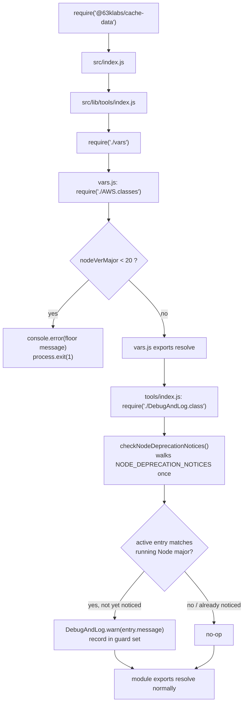
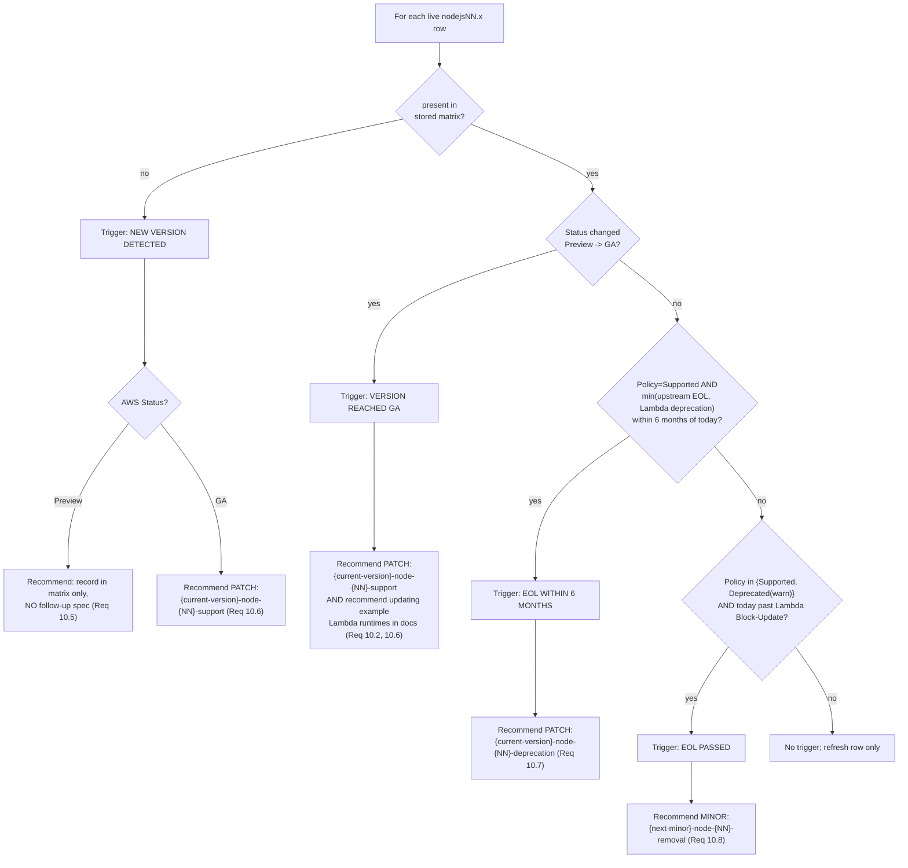

# Design Document: Node.js 26 Support + Node.js 20 Deprecation

## Overview

This design implements Node.js 26 support and a formal Node.js 20 deprecation for the `@63klabs/cache-data` package as a PATCH release (v1.3.17). It satisfies the ten requirements in `requirements.md`, which is the ground truth for this spec.

The work divides into three cooperating layers:

1. **Runtime behavior** (in `src/`) — a data-driven Node version deprecation notice registry plus an updated hard version floor, delivering the one-time Node 20 warning without changing any public API signature or behavior on Node 20/22/24/26.
2. **CI, packaging, and documentation** — a `test.yml` matrix update (add `'26'` as `continue-on-error`, keep `'20'` as a transition signal), an advisory `engines.node` bump, a `README.md` reconciliation, and a `CHANGELOG.md` entry.
3. **A reusable steering runbook** — `.kiro/steering/cache-data-node-support.md`, a manually-invoked report-only procedure that maintains a Node/Lambda support matrix and mechanically recommends follow-up specs for future runtime lifecycle events.

The central design principle is **backwards compatibility (Requirement 8)**: the only new user-visible runtime effect is a single warning that appears only when running on Node major version 20. Everything else is CI configuration, advisory metadata, documentation, and a steering document — none of which touches the runtime code path for supported versions.

### Research findings incorporated

The approved planning document (`PLAN.md`) already performed the landscape research and answered the open design questions. The findings that shape this design:

- **No source-level remediation is needed for Node 26.** A static scan of `src/**/*.js` for every Node 26 semver-major removal/deprecation (`http.Server.prototype.writeHeader`, legacy `_stream_*`, `crypto` DEP0182, DEP0203/DEP0204, stream DEP0201, `module.register()`, `--experimental-transform-types`) and other historically-deprecated patterns (`util.isArray`, `new Buffer()`, `url.parse`, `crypto.createCipher`/`createDecipher`, `process.binding`, `domain.create`, `punycode`) found **zero matches**. `dao-cache.js` already uses `crypto.createCipheriv`/`createDecipheriv` and native `structuredClone()`. This static conclusion must be confirmed by actually running the suite on Node 26 (Requirement 1). Sources: [Node.js 26.0.0 release notes](https://nodejs.org/en/blog/release/v26.0.0).
- **Node 20 reached upstream EOL on 2026-04-30** and no longer appears in the [AWS Lambda supported runtimes table](https://docs.aws.amazon.com/lambda/latest/dg/lambda-runtimes.html). **`nodejs26.x` is a Lambda public preview** ([AWS blog: public preview runtimes](https://aws.amazon.com/blogs/compute/introducing-public-preview-runtimes-on-aws-lambda-starting-with-node-js-26-and-python-3-15/)), which is why Node 26 is added to CI as `continue-on-error` and is *not* made the default example runtime or coverage leg in this release.
- **Three stale version references exist today** — `package.json` `engines.node: ">=20.0.0"`, `README.md` (says both `>=22.0.0` and `>=20.0.0`), and the `vars.js` hard floor (`< 16`, message "16 required, 18 preferred"). This spec reconciles all three.
- **An "at most once per process" guard already exists** in `src/lib/tools/index.js` as the `_deprecationNoticed` Set, used by three `AppConfig` deprecation notices. The new registry reuses this exact pattern.

> Content was rephrased for compliance with licensing restrictions.

## Architecture

### Module-load ordering (the key constraint)

The two version checks live in **different files** because they have different dependency needs and different severity, and both must run at module load before application code executes.



Why the split (reconciling Requirement 4 and Requirement 5):

- **The hard floor stays in `vars.js`.** `vars.js` is dependency-light — it only requires `./AWS.classes` (for `AWS.NODE_VER*`), not `DebugAndLog`. It already runs first, at the top of the `tools/index.js` require chain, and already owns the version-gate logic. A `process.exit(1)` must happen before anything else initializes, so it cannot wait for `DebugAndLog` to load. The floor check remains a plain `console.error` + `process.exit(1)` here, with only its threshold (`< 20`) and message text changed.
- **The registry-driven warning lives in `src/lib/tools/index.js`.** The Node 20 warning must go through `DebugAndLog.warn()` (Requirement 3.1) and must reuse the existing `_deprecationNoticed` Set (Requirement 4.3). Both `DebugAndLog` and `_deprecationNoticed` already exist in `tools/index.js`. Placing the registry walk here means it runs *after* the floor check has already guaranteed the running major is ≥ 20, and *after* `DebugAndLog` is available. This is the natural, lowest-risk home and avoids introducing a new `DebugAndLog` dependency into `vars.js`.

This placement is a direct implementation of PLAN.md Q9 answer (c): keep the hard floor in `vars.js` (fix its stale message, raise threshold to `< 20`), and route the once-per-process Node-20 warning through `DebugAndLog.warn()` using the established `_deprecationNoticed` pattern.

### Component placement decision (registry location and helper name)

The `NODE_DEPRECATION_NOTICES` registry and its walker helper are placed **in `src/lib/tools/index.js`**, colocated with `_deprecationNoticed` and `DebugAndLog`, for these reasons:

- Requirement 4.3 explicitly permits reusing the existing `_deprecationNoticed` Set "already present in `src/lib/tools/index.js`". Colocating avoids exporting or re-plumbing that Set into another module.
- The helper needs `DebugAndLog`, which is required into `tools/index.js` already.
- `vars.js` must stay dependency-light so its `process.exit(1)` floor can run before `DebugAndLog` loads.

**Names** (following repo naming conventions — `UPPER_SNAKE_CASE` constant, `camelCase` helper):

- Registry constant: `NODE_DEPRECATION_NOTICES`
- Walker helper: `checkNodeDeprecationNotices()`

The helper is a module-internal function (not exported) invoked exactly once during module load of `tools/index.js`, consistent with Requirement 4.2 ("invoked once at module load").

### CI, packaging, and documentation architecture

These are declarative/config changes with no runtime coupling:

| Artifact | Change | Requirement |
|---|---|---|
| `.github/workflows/test.yml` | Add `'26'` to matrix; `continue-on-error: true` only for the `'26'` leg; keep `'20'` unchanged; coverage stays on `'24'` only | 2.1–2.4 |
| `.github/workflows/npm-publish.yml` | **No change** (stays Node 24) | 2.5 |
| `package.json` | `engines.node`: `">=20.0.0"` → `">=22.0.0"` (advisory) | 6.1, 6.3 |
| `README.md` | Single consistent minimum Node version matching `engines.node` | 6.2 |
| `CHANGELOG.md` | New `## v1.3.17 (unreleased)` section: Node 26 under `Added`, Node 20 under `Deprecated` (plain "no fixed sunset date" format), spec reference, changelog-steering follow-up note | 7.1–7.4, 7.6 |
| `docs/**` example templates | **Unchanged** as primary example; optional short note that Node 26 is a Lambda public preview | 7.5 |

### Steering runbook architecture

`.kiro/steering/cache-data-node-support.md` is a manually-triggered (`inclusion: manual`) report-only document with two parts:

- **Part A — Support matrix**: a living table edited in place on each run.
- **Part B — Procedure**: fixed steps (fetch AWS data, diff, refresh, evaluate triggers, report) plus a standing note on Node's release cadence.

It never writes code, specs, or CI (Requirement 9.8) — it only emits a report with recommended follow-up spec names and rationales.

## Components and Interfaces

### Component 1: `NODE_DEPRECATION_NOTICES` registry (`src/lib/tools/index.js`)

An ordered array of plain data objects. Initial contents contain exactly one entry (Requirement 4.5, 3.2):

```javascript
// >! Node version deprecation notices are data, not bespoke conditionals.
// >! Ordered, append-only registry: when a Node major's support is later
// >! removed, set active:false rather than deleting the entry so the removal
// >! history and exact message text stay auditable (Req 4.4). New entries are
// >! added by the follow-up specs recommended by the runbook:
// >! .kiro/steering/cache-data-node-support.md (Req 4.6).
const NODE_DEPRECATION_NOTICES = [
	{
		version: 20,
		active: true, // flips to false in the v1.4.0 removal spec, not deleted
		message: "Node.js 20 reached end-of-life on 2026-04-30 and is no longer tested by @63klabs/cache-data; please upgrade to Node.js 22 or later."
	}
	// Future cycles append here, e.g.:
	// { version: 22, active: true, message: "..." }
];
```

**Entry shape:**

| Field | Type | Description |
|---|---|---|
| `version` | `number` | Node major version this notice applies to |
| `active` | `boolean` | Whether the notice should currently be emitted; `false` = version fully removed, kept for audit history |
| `message` | `string` | Exact warning text logged via `DebugAndLog.warn()` |

### Component 2: `checkNodeDeprecationNotices()` helper (`src/lib/tools/index.js`)

Module-internal function, invoked once at module load. Walks the registry and warns for any `active` entry whose `version` matches the running Node major version, at most once per `(process, version)`.

```javascript
/**
 * Emit a one-time deprecation warning for the running Node.js major version,
 * driven by the NODE_DEPRECATION_NOTICES registry.
 *
 * Walks the registry once and, for any active entry whose version matches the
 * running Node major version, logs the entry's message via DebugAndLog.warn().
 * Reuses the existing _deprecationNoticed Set so each notice is emitted at most
 * once per process. Emitting a warning has no effect on module initialization
 * or exported values.
 *
 * @private
 * @param {number} [runningMajor=nodeVerMajor] - Running Node.js major version. Parameterized for testability.
 * @returns {void}
 * @example
 * // Called once at module load; not part of the public API.
 * checkNodeDeprecationNotices();
 */
function checkNodeDeprecationNotices(runningMajor = nodeVerMajor) {
	for (const notice of NODE_DEPRECATION_NOTICES) {
		if (!notice.active || notice.version !== runningMajor) {
			continue;
		}
		const guardKey = `node-major-${notice.version}`;
		if (_deprecationNoticed.has(guardKey)) {
			continue;
		}
		_deprecationNoticed.add(guardKey);
		DebugAndLog.warn(notice.message);
	}
}
```

**Design notes:**

- The guard key is namespaced (`node-major-20`) so it cannot collide with the existing method-name keys (`_initParameters`, etc.) already stored in `_deprecationNoticed`.
- `nodeVerMajor` is the value already destructured from `require('./vars')` at the top of `tools/index.js`, itself sourced from `AWS.NODE_VER_MAJOR` (`process.versions.node`). The optional parameter exists purely so property-based tests can drive the function across a wide range of majors without spawning a subprocess for the pure-logic properties.
- No `process.env` access, no I/O, no shell — the function is pure aside from the `DebugAndLog.warn()` side effect and the guard-set mutation.

### Component 3: Updated hard floor (`src/lib/tools/vars.js`)

The existing `if (nodeVerMajor < 16)` block changes threshold and message only. It remains a `console.error` + `process.exit(1)` at module load, before other code (Requirement 5.1, 5.2, 5.4).

```javascript
// >! Hard floor: refuse to run on Node.js majors below the current minimum.
// >! Node 20 is NOT rejected here in v1.3.17 (it only warns, see the
// >! NODE_DEPRECATION_NOTICES registry in tools/index.js). The floor rises to
// >! < 22 in the v1.4.0 removal spec.
if (nodeVerMajor < 20) {
	console.error(`Node.js version 20 or higher is required for @63klabs/cache-data. Version ${nodeVer} detected. Please install at least Node.js 20 (22 or later recommended) in your environment.`);
	process.exit(1);
}
```

- Node 20 passes the floor (`20 < 20` is false) and receives only the Requirement 3 warning (Requirement 5.3).
- Node 22/24/26 pass with no exit and no floor message (Requirement 5.5); the deprecation warning does not match them either (Requirement 3.5).

### Component 4: `test.yml` matrix

```yaml
strategy:
  fail-fast: false
  matrix:
    node-version: ['20', '22', '24', '26']
    include:
      - node-version: '26'
        experimental: true

# ... in the job steps, the '26' leg is marked continue-on-error via a
# per-matrix expression:
#   continue-on-error: ${{ matrix.node-version == '26' }}
```

- Node 26 leg: `continue-on-error: true` (Requirement 2.2) so a preview-runtime failure does not fail the check.
- Node 20 leg: unchanged, not `continue-on-error` (Requirement 2.3).
- Coverage step conditions (`if: matrix.node-version == '24'`) are left exactly as-is so coverage runs only on Node 24 and never on 26 (Requirement 2.4).
- `fail-fast: false` is added so the Node 20/22/24 legs still report even if the experimental 26 leg errors; this does not change any leg's pass/fail semantics.

### Component 5: `cache-data-node-support.md` runbook interface

Front matter follows the pattern of `automation-assign-github-issues.md` and `automation-check-dependency-updates.md` (Requirement 9.1):

```yaml
---
inclusion: manual
description: "Manually-triggered runbook that checks AWS Lambda's current Node.js runtime support against a stored support matrix, refreshes the matrix, and reports any lifecycle triggers with recommended follow-up spec names. Report-only; never modifies code, specs, or CI."
---
```

**Interface contract:**

- **Input**: none beyond the current date and network access to AWS docs.
- **Effect**: rewrites Part A (the matrix) in place and prints a report.
- **Output**: a diff of matrix changes, the triggers fired, and recommended follow-up spec names each with a one-paragraph rationale — formatted to paste into a new planning conversation.
- **Non-effects**: never creates/modifies/executes any spec, code file, or CI configuration (Requirement 9.8).

## Data Models

### Deprecation notice entry

```javascript
/**
 * @typedef {Object} NodeDeprecationNotice
 * @property {number} version - Node.js major version the notice applies to (e.g. 20)
 * @property {boolean} active - Whether the notice is currently emitted; false = removed version kept for audit
 * @property {string} message - Exact warning text logged via DebugAndLog.warn()
 */
```

Invariants:

- `NODE_DEPRECATION_NOTICES` is append-only and ordered; entries are never deleted (Requirement 4.4).
- Initial state has exactly one entry: `{ version: 20, active: true, message: <the Requirement 3.2 text> }` (Requirement 4.5).

### Support matrix row (runbook Part A)

The matrix is Markdown, not code, but its schema is fixed (Requirement 9.3). Columns:

| Column | Meaning |
|---|---|
| Runtime | `nodejsNN.x` identifier |
| Node Major | integer major version |
| Package Policy | this repo's stance: `Supported`, `Deprecated (warn)`, or removed — may lag AWS intentionally (Requirement 9.5) |
| AWS Lambda Status | live AWS status: `Preview`, `GA`, or absent/deprecated |
| Upstream Node EOL | upstream end-of-life date |
| Lambda Deprecation Date | AWS Lambda deprecation date |
| Lambda Block-Create | date create-function is blocked |
| Lambda Block-Update | date update-function is blocked (the "EOL passed" forcing function) |
| Notes | free text |
| Last Checked | date the row was last refreshed |

Seed values (Requirement 9.4), from PLAN.md §9.2, as of 2026-09-25:

| Runtime | Node Major | Package Policy | AWS Lambda Status | Upstream Node EOL | Lambda Deprecation Date | Lambda Block-Create | Lambda Block-Update | Notes | Last Checked |
|---|---|---|---|---|---|---|---|---|---|
| `nodejs20.x` | 20 | Deprecated (warn) — as of v1.3.17 | Absent from AWS live table | 2026-04-30 | 2026-04-30 | ~2026-08-31 (3rd-party) | ~2026-09-30 (3rd-party) | AWS runtimes page no longer lists 20; third-party dates unconfirmed against official source, re-verify next run. | 2026-09-25 |
| `nodejs22.x` | 22 | Supported | GA | 2027-04-30 | 2027-04-30 | 2027-06-01 | 2027-07-01 | Active LTS. | 2026-09-25 |
| `nodejs24.x` | 24 | Supported (coverage + example default) | GA | 2028-04-30 | 2028-04-30 | 2028-06-01 | 2028-07-01 | Current LTS; used for `npm-publish.yml`. | 2026-09-25 |
| `nodejs26.x` | 26 | Supported (CI `continue-on-error`) | Preview | Not yet LTS (upstream "Current" 2026-05-05, LTS 2026-10-28) | Not scheduled | Not scheduled | Not scheduled | Lambda preview only; no SLA/support. | 2026-09-25 |

### Runbook trigger decision logic (Requirement 10)

The procedure evaluates each live `nodejsNN.x` row against these conditions **in order** and reports the matching trigger(s). This is the exact, deterministic decision table the runbook implements:



Each recommendation carries a one-paragraph rationale referencing the pattern this spec established (registry data addition, CI matrix change, `engines.node`/floor policy, or removal sweep, as applicable) — Requirement 10.9.

## Correctness Properties

*A property is a characteristic or behavior that should hold true across all valid executions of a system-essentially, a formal statement about what the system should do. Properties serve as the bridge between human-readable specifications and machine-verifiable correctness guarantees.*

The properties below were derived from the acceptance-criteria prework analysis (recorded via the prework tool) and then reduced for redundancy. The pure logic of the registry walker and the version-floor decision is well suited to property-based testing: both are functions of a single input (the running Node major version) over a large integer input space, with universal invariants ("warns exactly once", "warns only for a matching active entry", "exits only below the floor"). Infrastructure-flavored criteria (CI matrix YAML, `engines.node`, README, CHANGELOG, the runbook document) are validated by example/structural tests, not properties.

### Property 1: Deprecation warning fires at most once per process

*For any* running Node major version and *any* number of invocations of `checkNodeDeprecationNotices()` within a single process, the total number of warnings emitted for a given registry entry's version SHALL be at most one.

**Validates: Requirements 3.3, 4.2, 4.3**

### Property 2: Warning fires only for a matching active entry

*For any* running Node major version `m`, `checkNodeDeprecationNotices()` SHALL emit a warning if and only if the registry contains an `active` entry whose `version === m`; and when it emits, the logged text SHALL be exactly that entry's `message`.

**Validates: Requirements 3.1, 3.2, 4.1**

### Property 3: Inactive and non-matching entries never warn

*For any* running Node major version and *any* registry entry that is either `active: false` or whose `version` does not equal the running major, `checkNodeDeprecationNotices()` SHALL NOT emit a warning attributable to that entry.

**Validates: Requirements 3.5, 4.4**

### Property 4: Only Node 20 warns under the initial registry

*For any* running Node major version, with the registry in its initial single-entry state (`version: 20, active: true`), a warning SHALL be emitted when and only when the running major version is exactly 20.

**Validates: Requirements 3.1, 3.5, 4.5, 8.3**

### Property 5: Hard floor exits below 20 and only below 20

*For any* Node major version `m`, the `vars.js` floor check SHALL trigger `process.exit(1)` when and only when `m < 20`.

**Validates: Requirements 5.1, 5.3, 5.5**

### Property 6: Supported versions neither exit nor warn beyond the Node 20 case

*For any* Node major version in {22, 24, 26}, module load SHALL complete with no floor exit and no deprecation warning.

**Validates: Requirements 5.5, 3.5, 8.2**

### Property 7: Emitting a warning does not alter module exports

*For any* running Node major version, the set of names and the value identities exported by the package SHALL be identical whether or not the deprecation warning is emitted.

**Validates: Requirements 4.2, 8.1, 8.4**

## Error Handling

- **Below the floor (`< 20`)**: `console.error` with the corrected message, then `process.exit(1)`. This is intentional, immediate, and pre-dates this spec; only threshold and text change. Using `console.error` (not `DebugAndLog`) is required because the floor runs before `DebugAndLog` is loaded.
- **Deprecation warning path**: `DebugAndLog.warn()` is a non-throwing log call. The walker guards against duplicate emission with the `_deprecationNoticed` Set; it performs no I/O and cannot fail in a way that affects initialization (Requirement 3.6, 6-of-Req-3). If `DebugAndLog.warn` were ever to throw (it does not), the design still treats the walk as best-effort: it must never break module load. The implementation keeps the walk free of any operation that can throw.
- **Registry integrity**: entries are static literals authored in-repo; there is no runtime parsing or external input, so no validation of untrusted data is required. Adding a malformed entry is caught by the example/unit tests, not at runtime.
- **Runbook network fetch**: the runbook procedure prefers AWS documentation MCP tools with `web_fetch` as fallback (Requirement 9.7a). If the live table cannot be fetched, the runbook reports the failure and refreshes nothing rather than writing stale or guessed data. It is report-only, so a fetch failure has no side effects on code or specs.

## Testing Strategy

All tests use the repo's Jest conventions (`*.jest.mjs`, `expect`, `jest.spyOn`) and are executed via the direct Jest binary invocation pattern (`node --experimental-vm-modules node_modules/jest/bin/jest.js <file>`) per the test-execution-monitoring steering. No test invokes `npm test` from within a test file.

### Property-based tests (fast-check, ≥ 100 iterations each)

Property-based tests target the pure logic of the two version checks. Each test is tagged with a comment referencing its design property, format: `// Feature: 1-3-17-node-26-support, Property {number}: {property_text}`.

- **Properties 1–4 (registry walker)** are tested against `checkNodeDeprecationNotices(runningMajor)` using its optional parameter, spying on `DebugAndLog.warn` with `jest.spyOn` and asserting call count and argument. fast-check generates `runningMajor` across a wide integer range (including 20, the supported set, and unrelated majors) and generates synthetic registries (varying `active`, `version`, `message`) for Properties 2 and 3 so the universal "if and only if a matching active entry exists" statement is exercised, not just the single seeded entry. `jest.restoreAllMocks()` runs in `afterEach`.
- **Property 5 (hard floor)** is a pure boolean decision (`m < 20`) and is tested as a property over generated majors by extracting/mirroring the threshold predicate. The *actual* `process.exit(1)` behavior at module load (a process-level side effect) is verified separately by subprocess isolation (below), because `process.exit` cannot be exercised in-process without terminating the test runner.

### Subprocess-isolated tests (module-load and `process.exit` behavior)

Because Properties 5 and 6 concern behavior at module load — including `process.exit(1)` — they are verified by spawning a child Node process that requires the package, per the test-execution-monitoring and test-requirements steering (subprocess isolation, direct binary invocation, never `npm test`). Child processes are launched with **`execFile`-style array arguments, never a shell string** (secure-coding-practices: no `exec`/shell interpolation), e.g. `execFile(process.execPath, ['-e', script])`, with an explicit timeout and `maxBuffer`. These tests:

- Confirm that on the current (supported) runtime, requiring the package exits 0 and, when the major is 20, emits the exact warning text; when the major is 22/24/26, emits neither the floor message nor the warning (Property 6).
- Confirm the floor's exit-code-1 path via a harness that can simulate a sub-floor major where feasible; where the real running major cannot be forced below 20, the exit path is covered by the mirrored-predicate property test plus an example test asserting the message string and `process.exit` call are wired (using a spy on `process.exit` in an isolated import), so the branch is not left unexercised.

### Example / structural tests

Non-PBT criteria are covered by targeted example tests:

- **CI matrix (Req 2.1–2.5)**: parse `.github/workflows/test.yml` and assert the matrix includes `'26'`, that the `'26'` leg is `continue-on-error`, that `'20'` is present and not `continue-on-error`, and that coverage steps remain gated on `'24'`. Assert `npm-publish.yml` is unchanged (still Node 24).
- **`engines.node` and README (Req 6)**: assert `package.json` `engines.node === ">=22.0.0"` and that the README Requirements section states a single minimum matching it with no residual `>=20.0.0`.
- **CHANGELOG (Req 7)**: assert a `## v1.3.17 (unreleased)` section exists with a Node 26 `Added` entry, a Node 20 `Deprecated` entry in the plain no-sunset format, a reference to this spec directory, and the changelog-steering follow-up note.
- **Registry initial state (Req 4.5, 4.6)**: assert `NODE_DEPRECATION_NOTICES` has exactly one entry `{version:20, active:true, message:<Req 3.2 text>}` and that the documenting comment referencing the runbook and the `active:false` convention is present.
- **Runbook document (Req 9)**: assert the file exists with `inclusion: manual` front matter and a `description`, contains the matrix with the required columns seeded with `nodejs20.x`–`nodejs26.x`, keeps Package Policy and AWS Lambda Status as distinct columns, includes the Node cadence note, and describes the Part B procedure and the Requirement 10 trigger table. (The runbook's live-fetch behavior is documentation, not executed by tests.)
- **Backwards-compatibility export surface (Req 8.1)**: snapshot the exported names/shape of the package before and after and assert equality (Property 7 as an example-level regression guard in addition to the property test).

### Node 26 verification (Req 1)

Requirement 1 is satisfied operationally, not by a unit test: during implementation the full Jest suite is run once on Node 26 via the direct binary invocation. If failures appear only on 26, they are triaged and fixed (Req 1.2); if the suite passes unchanged, the static-analysis conclusion (no deprecated-API usage in `src/`) is documented as confirmed (Req 1.3). This is recorded in the implementation notes/CHANGELOG rather than asserted by an in-suite test, since it is a one-time cross-runtime verification.
