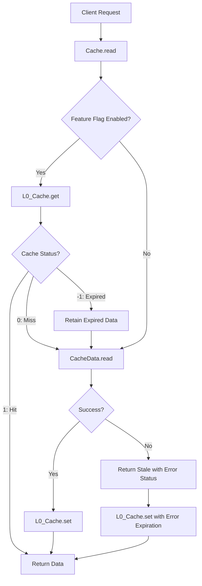

# Design Document: In-Memory L0 Cache

## Overview

This design document describes the implementation of an ultra-fast in-memory L0 cache layer for the AWS Lambda caching library. The cache provides microsecond-level access to frequently accessed data, reducing the need for repeated DynamoDB and S3 reads.

The design follows a Map-based LRU eviction strategy optimized for Lambda's execution model. The cache operates as a standalone module in `src/lib/utils/InMemoryCache.js` and integrates into the existing `Cache.read()` flow through a feature flag.

### Key Design Decisions

1. **Map-based storage**: JavaScript Map provides O(1) lookup and maintains insertion order for LRU
2. **Synchronous operations**: No timers or async cleanup to avoid Lambda execution issues
3. **Strict expiration**: Check expiration on every read, delete expired entries immediately
4. **Standalone module**: Independent implementation for testing and feature flag control
5. **Three-state return**: Cache hit (1), miss (0), expired (-1) for flexible fallback handling

## Architecture

### System Context



### Integration Points

1. **Cache.init()**: Accept `useInMemoryCache` parameter and `CACHE_USE_IN_MEMORY` environment variable
2. **Cache.read()**: Check L0_Cache before calling CacheData.read()
3. **Cache.update()**: Store fresh data in L0_Cache after successful DynamoDB reads
4. **Error handling**: Store stale data with extended expiration when DynamoDB fails

## Components and Interfaces

### InMemoryCache Class

The core cache implementation stored in `src/lib/utils/InMemoryCache.js`.

#### Constructor

```javascript
constructor(options = {})
```

**Parameters:**
- `options.maxEntries` (number, optional): Maximum number of entries. If not provided, calculated from Lambda memory
- `options.entriesPerGB` (number, optional): Heuristic for calculating maxEntries (default: 5000)
- `options.defaultMaxEntries` (number, optional): Fallback if Lambda memory unavailable (default: 1000)

**Behavior:**
- Reads `process.env.AWS_LAMBDA_FUNCTION_MEMORY_SIZE` to determine Lambda memory
- Calculates `maxEntries = (memoryMB / 1024) * entriesPerGB`
- Falls back to `defaultMaxEntries` if memory size unavailable
- Initializes empty Map for storage

#### get(key)

```javascript
get(key)
```

**Parameters:**
- `key` (string): Cache key (typically idHash)

**Returns:**
```javascript
{
  cache: 1 | 0 | -1,  // 1=hit, 0=miss, -1=expired
  data: CacheDataFormat | null
}
```

**Behavior:**
1. Check if key exists in Map
2. If not exists, return `{cache: 0, data: null}`
3. If exists, check expiration: `entry.expiresAt <= Date.now()`
4. If expired:
   - Delete entry from Map
   - Return `{cache: -1, data: entry.value}`
5. If valid:
   - Move entry to end (delete then re-set for LRU)
   - Return `{cache: 1, data: entry.value}`

#### set(key, value, expiresAt)

```javascript
set(key, value, expiresAt)
```

**Parameters:**
- `key` (string): Cache key
- `value` (CacheDataFormat): Data to cache
- `expiresAt` (number): Expiration timestamp in milliseconds

**Returns:** void

**Behavior:**
1. If key exists, delete it first (for LRU repositioning)
2. Check if Map size >= maxEntries
3. If at capacity:
   - Get first entry (oldest): `map.keys().next().value`
   - Delete oldest entry
4. Store new entry: `map.set(key, {value, expiresAt})`

#### clear()

```javascript
clear()
```

**Returns:** void

**Behavior:**
- Clears all entries from the Map
- Used for testing or manual cache invalidation

#### info()

```javascript
info()
```

**Returns:**
```javascript
{
  size: number,           // Current number of entries
  maxEntries: number,     // Maximum capacity
  memoryMB: number | null // Lambda memory allocation
}
```

### Cache Class Modifications

#### Static Properties

Add new status code constant:

```javascript
static STATUS_CACHE_IN_MEM = "cache:memory";
```

Add static property for feature flag:

```javascript
static #useInMemoryCache = false;
```

Add static property for L0_Cache instance:

```javascript
static #inMemoryCache = null;
```

#### Cache.init() Modifications

```javascript
static init(parameters) {
  // ... existing initialization ...
  
  // Initialize in-memory cache feature flag
  this.#useInMemoryCache = parameters.useInMemoryCache || 
    (process.env.CACHE_USE_IN_MEMORY === 'true') || 
    false;
  
  // Initialize L0_Cache if enabled
  if (this.#useInMemoryCache) {
    const InMemoryCache = require('./utils/InMemoryCache.js');
    this.#inMemoryCache = new InMemoryCache({
      maxEntries: parameters.inMemoryCacheMaxEntries,
      entriesPerGB: parameters.inMemoryCacheEntriesPerGB,
      defaultMaxEntries: parameters.inMemoryCacheDefaultMaxEntries
    });
  }
  
  // ... rest of initialization ...
}
```

#### Cache.read() Modifications

```javascript
async read() {
  return new Promise(async (resolve) => {
    if (this.#store !== null) {
      resolve(this.#store);
    } else {
      try {
        let staleData = null;
        
        // Check L0_Cache if feature is enabled
        if (Cache.#useInMemoryCache && Cache.#inMemoryCache !== null) {
          const memResult = Cache.#inMemoryCache.get(this.#idHash);
          
          if (memResult.cache === 1) {
            // Cache hit - return immediately
            this.#store = memResult.data;
            this.#status = Cache.STATUS_CACHE_IN_MEM;
            tools.DebugAndLog.debug(`In-memory cache hit: ${this.#idHash}`);
            resolve(this.#store);
            return;
          } else if (memResult.cache === -1) {
            // Expired - retain for potential fallback
            staleData = memResult.data;
            tools.DebugAndLog.debug(`In-memory cache expired, retaining stale data: ${this.#idHash}`);
          }
          // cache === 0 means miss, continue to DynamoDB
        }
        
        // Fetch from DynamoDB
        this.#store = await CacheData.read(this.#idHash, this.#syncedLaterTimestampInSeconds);
        this.#status = (this.#store.cache.statusCode === null) ? Cache.STATUS_NO_CACHE : Cache.STATUS_CACHE;
        
        // Store in L0_Cache if successful and feature enabled
        if (Cache.#useInMemoryCache && Cache.#inMemoryCache !== null && this.#store.cache.statusCode !== null) {
          const expiresAt = this.#store.cache.expires * 1000; // Convert to milliseconds
          Cache.#inMemoryCache.set(this.#idHash, this.#store, expiresAt);
          tools.DebugAndLog.debug(`Stored in L0_Cache: ${this.#idHash}`);
        }
        
        tools.DebugAndLog.debug(`Cache Read status: ${this.#status}`);
        resolve(this.#store);
        
      } catch (error) {
        // Error occurred - check if we have stale data to return
        if (staleData !== null) {
          // Calculate new expiration using error extension
          const newExpires = this.#syncedNowTimestampInSeconds + this.#defaultExpirationExtensionOnErrorInSeconds;
          const newExpiresAt = newExpires * 1000;
          
          // Update stale data expiration
          staleData.cache.expires = newExpires;
          
          // Store updated stale data back in L0_Cache
          if (Cache.#useInMemoryCache && Cache.#inMemoryCache !== null) {
            Cache.#inMemoryCache.set(this.#idHash, staleData, newExpiresAt);
          }
          
          this.#store = staleData;
          this.#status = Cache.STATUS_CACHE_ERROR;
          tools.DebugAndLog.warn(`Returning stale data due to error: ${this.#idHash}`);
        } else {
          this.#store = CacheData.format(this.#syncedLaterTimestampInSeconds);
          this.#status = Cache.STATUS_CACHE_ERROR;
        }
        
        tools.DebugAndLog.error(`Cache Read: Cannot read cached data for ${this.#idHash}: ${error?.message || 'Unknown error'}`, error?.stack);
        resolve(this.#store);
      }
    }
  });
}
```

#### Cache.info() Modifications

```javascript
static info() {
  const info = Object.assign({ idHashAlgorithm: this.#idHashAlgorithm }, CacheData.info());
  
  // Add in-memory cache info
  info.useInMemoryCache = this.#useInMemoryCache;
  if (this.#useInMemoryCache && this.#inMemoryCache !== null) {
    info.inMemoryCache = this.#inMemoryCache.info();
  }
  
  return info;
}
```

## Data Models

### Internal Cache Entry

Stored in the Map:

```javascript
{
  value: CacheDataFormat,  // The cached data
  expiresAt: number        // Expiration timestamp in milliseconds
}
```

### CacheDataFormat

The existing format (unchanged):

```javascript
{
  cache: {
    body: string,
    headers: object,
    expires: number,      // Unix timestamp in seconds
    statusCode: string
  }
}
```

### Cache Lookup Result

Returned by `InMemoryCache.get()`:

```javascript
{
  cache: 1 | 0 | -1,           // 1=hit, 0=miss, -1=expired
  data: CacheDataFormat | null // Data if hit or expired, null if miss
}
```

## Correctness Properties

*A property is a characteristic or behavior that should hold true across all valid executions of a system—essentially, a formal statement about what the system should do. Properties serve as the bridge between human-readable specifications and machine-verifiable correctness guarantees.*

Before defining the correctness properties, I need to analyze each acceptance criterion to determine which are testable as properties, examples, or edge cases.


### Property 1: Cache Entry Round-Trip Preservation

*For any* valid CacheDataFormat object and expiration timestamp, storing the object in L0_Cache and then retrieving it (before expiration) should return the exact same CacheDataFormat object with all fields preserved and the same expiration timestamp.

**Validates: Requirements 1.2, 3.5, 7.3**

### Property 2: Valid Entry Returns Hit Status

*For any* cache entry that is stored and not expired, retrieving it should return cache status 1 with the stored CacheDataFormat object.

**Validates: Requirements 2.1**

### Property 3: Missing Key Returns Miss Status

*For any* key that has never been stored in the cache, retrieving it should return cache status 0 with null data.

**Validates: Requirements 2.2**

### Property 4: Expired Entry Returns Expired Status and Deletes

*For any* cache entry that is stored with an expiration timestamp in the past, retrieving it should return cache status -1 with the expired CacheDataFormat object, and a subsequent retrieval should return cache status 0 (entry deleted).

**Validates: Requirements 2.3, 6.3**

### Property 5: Storing Existing Key Updates Entry

*For any* key that already exists in the cache, storing a new value with that key should replace the old value, and retrieving the key should return the new value.

**Validates: Requirements 3.3**

### Property 6: LRU Eviction When At Capacity

*For any* cache at maximum capacity, storing a new entry should evict the least recently used entry (the first entry that was stored and not accessed since).

**Validates: Requirements 4.1**

### Property 7: Access Updates LRU Position

*For any* cache with multiple entries, accessing an entry should move it to the most recently used position, preventing it from being evicted before entries that were not accessed.

**Validates: Requirements 4.3**

### Property 8: MAX_ENTRIES Calculation From Memory

*For any* Lambda memory allocation value and entries-per-GB heuristic, the calculated MAX_ENTRIES should equal (memoryMB / 1024) * entriesPerGB.

**Validates: Requirements 5.2**

### Property 9: Feature Flag Disabled Prevents L0_Cache Usage

*For any* Cache operation when the feature flag is false, the L0_Cache should never be accessed or called.

**Validates: Requirements 8.4**

### Property 10: Cache Hit Returns Data Immediately

*For any* valid cache entry in L0_Cache, Cache.read() with feature flag enabled should return the cached data with STATUS_CACHE_IN_MEM without calling CacheData.read().

**Validates: Requirements 9.1**

## Error Handling

### L0_Cache Error Handling

The L0_Cache module itself has minimal error handling since it operates entirely in memory with simple operations:

1. **Invalid parameters**: Constructor validates options and uses safe defaults
2. **Missing environment variables**: Falls back to defaultMaxEntries
3. **Map operations**: JavaScript Map operations are synchronous and don't throw in normal usage

### Cache.read() Error Handling

The Cache.read() method handles errors from DynamoDB and uses L0_Cache for fallback:

1. **DynamoDB read fails with expired L0_Cache data**:
   - Calculate new expiration: `syncedNow + defaultExpirationExtensionOnErrorInSeconds`
   - Update expired data with new expiration
   - Store updated data back in L0_Cache
   - Return data with STATUS_CACHE_ERROR

2. **DynamoDB read fails without L0_Cache data**:
   - Return empty cache format
   - Set status to STATUS_CACHE_ERROR

3. **L0_Cache initialization fails**:
   - Log error
   - Continue without L0_Cache (graceful degradation)
   - All operations fall back to DynamoDB

### Error Status Codes

- `STATUS_CACHE_IN_MEM`: Data served from L0_Cache (success)
- `STATUS_CACHE_ERROR`: Error occurred, stale data returned if available
- `STATUS_NO_CACHE`: No cached data available
- `STATUS_CACHE`: Data served from DynamoDB/S3 (existing behavior)

## Testing Strategy

### Dual Testing Approach

This feature requires both unit tests and property-based tests for comprehensive coverage:

**Unit Tests** focus on:
- Specific examples of cache operations
- Edge cases (empty cache, single entry, at capacity)
- Integration points with Cache class
- Error scenarios and fallback behavior
- Feature flag configuration

**Property Tests** focus on:
- Universal properties across all inputs
- LRU eviction correctness with random access patterns
- Round-trip data preservation with random CacheDataFormat objects
- Expiration handling with random timestamps
- Capacity management with random entry counts

### Property-Based Testing Configuration

- **Library**: Use fast-check for JavaScript property-based testing
- **Iterations**: Minimum 100 iterations per property test
- **Tagging**: Each property test must reference its design property

Tag format: `// Feature: in-memory-cache, Property {number}: {property_text}`

Example:
```javascript
// Feature: in-memory-cache, Property 1: Cache Entry Round-Trip Preservation
```

### Test Organization

Tests should be organized in `test/cache/` directory following existing structure:

```
test/cache/
  in-memory-cache/
    unit/
      InMemoryCache-basic-tests.mjs
      InMemoryCache-eviction-tests.mjs
      InMemoryCache-expiration-tests.mjs
    property/
      InMemoryCache-property-tests.mjs
    integration/
      Cache-integration-tests.mjs
```

### Mock Data Strategy

All tests use mock CacheDataFormat objects without requiring DynamoDB connections:

```javascript
const mockCacheData = {
  cache: {
    body: JSON.stringify({test: "data"}),
    headers: {"content-type": "application/json"},
    expires: Math.floor(Date.now() / 1000) + 3600,
    statusCode: "200"
  }
};
```

### Key Test Scenarios

1. **Basic Operations**:
   - Store and retrieve valid entry
   - Retrieve non-existent key
   - Store and retrieve expired entry
   - Update existing entry

2. **LRU Eviction**:
   - Fill cache to capacity
   - Add one more entry, verify oldest evicted
   - Access old entry, add new entry, verify accessed entry not evicted

3. **Expiration**:
   - Store entry with past expiration, verify expired status
   - Store entry with future expiration, verify hit status
   - Verify expired entry is deleted after retrieval

4. **Memory Management**:
   - Test MAX_ENTRIES calculation with various memory sizes
   - Test fallback to default when memory unavailable
   - Test custom maxEntries parameter

5. **Feature Flag**:
   - Test Cache.init() with useInMemoryCache parameter
   - Test Cache.init() with CACHE_USE_IN_MEMORY environment variable
   - Test Cache.init() with default (false)
   - Verify L0_Cache not used when flag is false

6. **Integration**:
   - Test Cache.read() with L0_Cache hit
   - Test Cache.read() with L0_Cache miss
   - Test Cache.read() with L0_Cache expired entry
   - Test error fallback with stale data

### Property Test Examples

**Property 1: Round-Trip Preservation**
```javascript
fc.assert(
  fc.property(
    fc.record({
      cache: fc.record({
        body: fc.string(),
        headers: fc.dictionary(fc.string(), fc.string()),
        expires: fc.integer({min: Date.now() / 1000, max: Date.now() / 1000 + 86400}),
        statusCode: fc.string()
      })
    }),
    fc.integer({min: Date.now() + 1000, max: Date.now() + 86400000}),
    (cacheData, expiresAt) => {
      const cache = new InMemoryCache();
      const key = "test-key";
      cache.set(key, cacheData, expiresAt);
      const result = cache.get(key);
      return result.cache === 1 && 
             JSON.stringify(result.data) === JSON.stringify(cacheData);
    }
  ),
  {numRuns: 100}
);
```

**Property 6: LRU Eviction**
```javascript
fc.assert(
  fc.property(
    fc.integer({min: 2, max: 10}),
    fc.array(fc.string(), {minLength: 1}),
    (maxEntries, keys) => {
      const cache = new InMemoryCache({maxEntries});
      const uniqueKeys = [...new Set(keys)].slice(0, maxEntries + 1);
      
      // Fill cache to capacity
      for (let i = 0; i < maxEntries; i++) {
        cache.set(uniqueKeys[i], {cache: {body: `data${i}`}}, Date.now() + 10000);
      }
      
      // Add one more - should evict first
      cache.set(uniqueKeys[maxEntries], {cache: {body: "new"}}, Date.now() + 10000);
      
      // First key should be evicted
      const firstResult = cache.get(uniqueKeys[0]);
      return firstResult.cache === 0;
    }
  ),
  {numRuns: 100}
);
```
