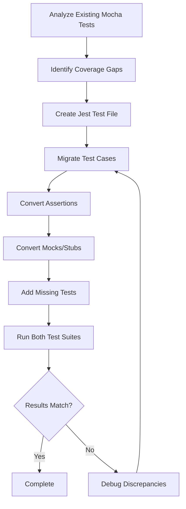

# Design Document

## Overview

This design outlines the approach for migrating existing Mocha tests to Jest for three modules: APIRequest.class.js, dao-endpoint.js, and AWS.classes.js. The migration will maintain backwards compatibility, ensure no breaking changes, and run both test frameworks in parallel during the transition period. The design also addresses test coverage gaps and establishes patterns for future test migrations.

### Migration Strategy

The migration follows a parallel execution strategy where both Mocha and Jest tests coexist and run simultaneously. This approach provides:

1. **Validation**: Ensures Jest tests produce equivalent results to Mocha tests
2. **Safety**: Catches any discrepancies between test frameworks early
3. **Confidence**: Allows gradual migration without risk to existing test coverage
4. **Consistency**: Maintains test suite reliability throughout the migration

### Modules in Scope

1. **APIRequest.class.js** (`src/lib/tools/APIRequest.class.js`)
   - HTTP/HTTPS request handling
   - Redirect management
   - Timeout handling
   - Request/response formatting
   - X-Ray integration

2. **dao-endpoint.js** (`src/lib/dao-endpoint.js`)
   - Endpoint request class
   - Connection configuration
   - Query parameter merging
   - JSON response parsing

3. **AWS.classes.js** (`src/lib/tools/AWS.classes.js`)
   - AWS SDK version detection
   - DynamoDB client wrapper
   - S3 client wrapper
   - SSM client wrapper
   - X-Ray initialization

## Architecture

### Test File Organization

```
test/
├── endpoint/
│   ├── api-request-tests.mjs          # Existing Mocha tests
│   ├── api-request-tests.jest.mjs     # New Jest tests (parallel)
│   ├── endpoint-dao-tests.mjs         # Existing Mocha tests
│   └── endpoint-dao-tests.jest.mjs    # New Jest tests (parallel)
└── tools/
    ├── aws-classes-tests.mjs          # Existing Mocha tests (to be created if missing)
    └── aws-classes-tests.jest.mjs     # New Jest tests (parallel)
```

### Test Execution Flow

```
npm test
    ├── Mocha Test Suite
    │   ├── test/endpoint/api-request-tests.mjs
    │   ├── test/endpoint/endpoint-dao-tests.mjs
    │   └── test/tools/aws-classes-tests.mjs
    │
    └── Jest Test Suite
        ├── test/endpoint/api-request-tests.jest.mjs
        ├── test/endpoint/endpoint-dao-tests.jest.mjs
        └── test/tools/aws-classes-tests.jest.mjs
```

### Migration Workflow



## Components and Interfaces

### Test Framework Mapping

#### Mocha to Jest Syntax Mapping

| Mocha/Chai | Jest | Notes |
|------------|------|-------|
| `describe()` | `describe()` | Same syntax |
| `it()` | `it()` or `test()` | Jest supports both |
| `expect().to.equal()` | `expect().toBe()` | Strict equality |
| `expect().to.deep.equal()` | `expect().toEqual()` | Deep equality |
| `expect().to.be.true` | `expect().toBe(true)` | Boolean checks |
| `expect().to.be.false` | `expect().toBe(false)` | Boolean checks |
| `expect().to.have.lengthOf()` | `expect().toHaveLength()` | Array/string length |
| `expect().to.not.throw()` | `expect().not.toThrow()` | Exception testing |
| `sinon.stub()` | `jest.fn()` | Mock functions |
| `sinon.restore()` | `jest.restoreAllMocks()` | Cleanup |
| `beforeEach()` | `beforeEach()` | Same syntax |
| `afterEach()` | `afterEach()` | Same syntax |

#### Module Import Patterns

**Mocha (ESM):**
```javascript
import { expect } from 'chai';
import sinon from 'sinon';
import { APIRequest } from '../../src/lib/tools/index.js';
```

**Jest (ESM):**
```javascript
import { jest } from '@jest/globals';
import { APIRequest } from '../../src/lib/tools/index.js';
```

### Test Structure Components

#### 1. Test File Header

Each Jest test file includes:
- Migration source documentation
- Requirements validation references
- Module description
- Import statements

**Template:**
```javascript
/**
 * Jest tests for [Module Name]
 * Migrated from: test/[path]/[original-file].mjs
 * 
 * Tests [module functionality description]
 * 
 * Validates: Requirements [X.Y, X.Z]
 */

import { jest } from '@jest/globals';
// Additional imports...
```

#### 2. Test Suite Organization

```javascript
describe('[Module Name]', () => {
    // Setup
    beforeEach(() => {
        // Initialize test state
        jest.clearAllMocks();
    });

    afterEach(() => {
        // Cleanup
        jest.restoreAllMocks();
    });

    describe('[Feature/Method Name]', () => {
        it('should [expected behavior]', async () => {
            // Arrange
            // Act
            // Assert
        });
    });
});
```

#### 3. Mock Management

**Mocha Pattern:**
```javascript
let stub;
beforeEach(() => {
    stub = sinon.stub(console, 'error').callsFake(() => {});
});
afterEach(() => {
    stub.restore();
});
```

**Jest Pattern:**
```javascript
beforeEach(() => {
    jest.spyOn(console, 'error').mockImplementation(() => {});
});
afterEach(() => {
    jest.restoreAllMocks();
});
```

## Data Models

### Test Case Structure

```typescript
interface TestCase {
    description: string;           // Test description
    setup: () => void;            // Test setup/arrange
    action: () => Promise<any>;   // Test action/act
    assertions: () => void;       // Test assertions/assert
    cleanup: () => void;          // Test cleanup
}
```

### Test Coverage Report

```typescript
interface CoverageReport {
    module: string;               // Module name
    totalLines: number;           // Total lines of code
    coveredLines: number;         // Lines covered by tests
    coveragePercent: number;      // Coverage percentage
    uncoveredPaths: string[];     // Untested code paths
    missingTests: string[];       // Missing test cases
}
```

### Migration Status

```typescript
interface MigrationStatus {
    module: string;               // Module name
    mochaTests: number;           // Number of Mocha tests
    jestTests: number;            // Number of Jest tests
    migrated: boolean;            // Migration complete
    discrepancies: string[];      // Differences found
}
```

## Correctness Properties

*A property is a characteristic or behavior that should hold true across all valid executions of a system—essentially, a formal statement about what the system should do. Properties serve as the bridge between human-readable specifications and machine-verifiable correctness guarantees.*


### Property Reflection

After analyzing all acceptance criteria, I identified several redundant properties:

**Redundancies Identified:**
- Requirements 1.2 and 1.3 both test that Mocha and Jest produce equivalent results - can be combined
- Requirements 2.1-2.5, 3.1-3.5 are identical to 1.1-1.5 for different modules - can be generalized
- Requirements 6.1 and 6.6 both test that npm test runs both suites - redundant
- Requirements 6.5 and 7.2 both test .jest.mjs extension - redundant
- Requirements 7.1 and 7.4 both test same directory structure - redundant

**Properties to Combine:**
- Test completeness across all three modules (1.1, 2.1, 3.1)
- Test equivalence across all three modules (1.2, 1.3, 2.2, 2.3, 3.2, 3.3)
- Coverage preservation across all three modules (1.4, 2.4, 3.4)
- Test description preservation across all three modules (1.5, 2.5, 3.5)

This consolidation reduces ~30 potential properties to ~15 unique, comprehensive properties.

### Correctness Properties

**Property 1: Test Migration Completeness**
*For any* module in scope (APIRequest.class, dao-endpoint, AWS.classes), the number of test cases in the Jest test file should equal the number of test cases in the corresponding Mocha test file.
**Validates: Requirements 1.1, 2.1, 3.1**

**Property 2: Test Execution Equivalence**
*For any* module in scope, when both Mocha and Jest test suites are executed, both should pass with the same number of passing tests and zero failures.
**Validates: Requirements 1.2, 1.3, 2.2, 2.3, 3.2, 3.3**

**Property 3: Test Coverage Preservation**
*For any* module in scope, the code coverage percentage after Jest migration should be greater than or equal to the coverage percentage before migration.
**Validates: Requirements 1.4, 2.4, 3.4**

**Property 4: Test Description Preservation**
*For any* test case migrated from Mocha to Jest, the test description (it/test string) should be semantically equivalent to the original Mocha test description.
**Validates: Requirements 1.5, 2.5, 3.5**

**Property 5: Public Method Coverage**
*For any* public method in the modules in scope, there should exist at least one test case (in either Mocha or Jest) that exercises that method.
**Validates: Requirements 4.5**

**Property 6: Error Path Coverage**
*For any* error handling path (try/catch, error conditions) in the modules in scope, there should exist at least one test case that exercises that error path.
**Validates: Requirements 4.6**

**Property 7: Source Code Immutability**
*For any* source file in scope (APIRequest.class.js, dao-endpoint.js, AWS.classes.js), the file content hash before migration should equal the file content hash after migration.
**Validates: Requirements 5.1, 5.2, 5.3**

**Property 8: Function Signature Preservation**
*For any* public function in the modules in scope, the function signature (parameter names, parameter count, return type) should remain unchanged after test migration.
**Validates: Requirements 5.5**

**Property 9: Production Dependency Immutability**
*For all* production dependencies in package.json (excluding devDependencies), the dependency list should remain unchanged after test migration.
**Validates: Requirements 5.6**

**Property 10: Original Test File Retention**
*For any* Mocha test file that existed before migration, that file should still exist in the same location after migration.
**Validates: Requirements 6.4**

**Property 11: Jest File Naming Convention**
*For any* Jest test file created during migration, the filename should follow the pattern `[original-name].jest.mjs` where `[original-name]` is the Mocha test filename without extension.
**Validates: Requirements 6.5, 7.2, 7.3**

**Property 12: Jest File Location Convention**
*For any* Jest test file created during migration, the file should be located in the same directory as its corresponding Mocha test file.
**Validates: Requirements 7.1, 7.4**

**Property 13: Jest Migration Documentation**
*For any* Jest test file, the file should contain a header comment that includes: (1) reference to the original Mocha test file, (2) module description, and (3) requirements validation references.
**Validates: Requirements 7.5, 9.1, 9.2, 9.3, 9.4, 9.5**

**Property 14: Jest Syntax Compliance**
*For any* Jest test file, the file should use Jest-specific syntax including: (1) `jest.fn()` for mocks, (2) Jest `expect()` assertions, (3) `beforeEach`/`afterEach` for setup/teardown, and (4) `jest.restoreAllMocks()` in cleanup.
**Validates: Requirements 8.1, 8.2, 8.3, 8.4, 8.5, 8.6, 8.7**

**Property 15: Test Cleanup Presence**
*For any* Jest test file that uses mocks, the file should contain an `afterEach` block that calls `jest.restoreAllMocks()` to ensure test isolation.
**Validates: Requirements 10.3, 10.5**

## Error Handling

### Migration Error Scenarios

1. **Test Count Mismatch**
   - **Scenario**: Jest test file has fewer tests than Mocha file
   - **Detection**: Property 1 validation fails
   - **Resolution**: Review migration, identify missing tests, add to Jest file

2. **Test Execution Discrepancy**
   - **Scenario**: Mocha tests pass but Jest tests fail (or vice versa)
   - **Detection**: Property 2 validation fails
   - **Resolution**: Debug failing tests, check for framework-specific issues, verify mock behavior

3. **Coverage Regression**
   - **Scenario**: Jest tests provide less coverage than Mocha tests
   - **Detection**: Property 3 validation fails
   - **Resolution**: Identify uncovered code paths, add missing test cases

4. **Source Code Modification**
   - **Scenario**: Source files accidentally modified during migration
   - **Detection**: Property 7 validation fails
   - **Resolution**: Revert source file changes, re-run migration

5. **Dependency Pollution**
   - **Scenario**: Production dependencies added during migration
   - **Detection**: Property 9 validation fails
   - **Resolution**: Move dependencies to devDependencies, verify package.json

### Error Handling in Tests

#### Timeout Handling

Both Mocha and Jest tests must handle timeout scenarios consistently:

```javascript
// Mocha pattern (existing)
it('Test timeout', async () => {
    const errorStub = sinon.stub(console, 'error').callsFake(() => {});
    const warnStub = sinon.stub(console, 'warn').callsFake(() => {});
    try {
        const result = await apiRequest.send();
        expect(result.statusCode).to.equal(504);
    } finally {
        errorStub.restore();
        warnStub.restore();
    }
});

// Jest pattern (migrated)
it('Test timeout', async () => {
    jest.spyOn(console, 'error').mockImplementation(() => {});
    jest.spyOn(console, 'warn').mockImplementation(() => {});
    
    const result = await apiRequest.send();
    expect(result.statusCode).toBe(504);
    
    jest.restoreAllMocks();
});
```

#### Mock Cleanup

All mocks must be cleaned up to prevent test pollution:

```javascript
// Mocha pattern
afterEach(() => {
    sinon.restore();
});

// Jest pattern
afterEach(() => {
    jest.restoreAllMocks();
    jest.clearAllMocks();
});
```

#### Async Error Handling

Both frameworks must handle async errors consistently:

```javascript
// Mocha pattern
it('should handle async errors', async () => {
    try {
        await operation();
        expect.fail('Should have thrown');
    } catch (error) {
        expect(error.message).to.include('expected error');
    }
});

// Jest pattern
it('should handle async errors', async () => {
    await expect(operation()).rejects.toThrow('expected error');
});
```

## Testing Strategy

### Dual Testing Approach

During the migration period, both unit tests and property-based tests are required:

**Unit Tests (Mocha and Jest)**:
- Verify specific examples and expected behavior
- Test edge cases (null, undefined, empty values, boundary conditions)
- Test error conditions and error messages
- Validate integration between components
- Both Mocha and Jest versions must pass

**Property-Based Tests**:
- Verify universal properties across all inputs
- Validate correctness properties defined in this document
- Run with minimum 100 iterations per property
- Tag each property test with feature and property number

### Test Execution Configuration

#### Mocha Configuration

Existing Mocha tests continue to run with current configuration:

```bash
# Run all Mocha tests
npm test

# Run specific Mocha test file
npm test -- test/endpoint/api-request-tests.mjs
```

#### Jest Configuration

New Jest tests run in parallel:

```bash
# Run all Jest tests
npm run test:jest

# Run specific Jest test file
npm run test:jest -- test/endpoint/api-request-tests.jest.mjs

# Run all tests (Mocha + Jest)
npm run test:all
```

#### Property Test Configuration

Property-based tests for migration validation:

```javascript
/**
 * Property-based test for test migration completeness
 * Feature: test-migration-phase-2, Property 1: Test Migration Completeness
 */
import fc from 'fast-check';

describe('Test Migration Properties', () => {
    it('Property 1: Test Migration Completeness', () => {
        fc.assert(
            fc.property(
                fc.constantFrom('api-request', 'endpoint-dao', 'aws-classes'),
                (moduleName) => {
                    const mochaTestCount = countMochaTests(moduleName);
                    const jestTestCount = countJestTests(moduleName);
                    return mochaTestCount === jestTestCount;
                }
            ),
            { numRuns: 100 }
        );
    });
});
```

### Coverage Requirements

**Minimum Coverage Targets**:
- Line Coverage: ≥ 80% (must not decrease)
- Branch Coverage: ≥ 75% (must not decrease)
- Function Coverage: ≥ 90% (must not decrease)

**Coverage Measurement**:
```bash
# Generate coverage report
npm run coverage

# View coverage report
open coverage/index.html
```

### Test Organization

**Test File Structure**:
```
test/
├── endpoint/
│   ├── api-request-tests.mjs           # Mocha tests (existing)
│   ├── api-request-tests.jest.mjs      # Jest tests (new)
│   ├── endpoint-dao-tests.mjs          # Mocha tests (existing)
│   └── endpoint-dao-tests.jest.mjs     # Jest tests (new)
├── tools/
│   ├── aws-classes-tests.mjs           # Mocha tests (new if missing)
│   └── aws-classes-tests.jest.mjs      # Jest tests (new)
└── migration/
    └── property/
        └── test-migration-property-tests.mjs  # Property tests for migration validation
```

### Test Naming Conventions

**Mocha Tests**: `*-tests.mjs`
**Jest Tests**: `*-tests.jest.mjs`
**Property Tests**: `*-property-tests.mjs`

### Test Documentation

Each test file must include:

1. **File Header**: Module description, migration source, requirements references
2. **Test Descriptions**: Clear, descriptive test names
3. **Inline Comments**: Explain complex test logic
4. **Validation Tags**: Link tests to requirements and properties

**Example**:
```javascript
/**
 * Jest tests for APIRequest.class
 * Migrated from: test/endpoint/api-request-tests.mjs
 * 
 * Tests HTTP/HTTPS request handling, redirect management, timeout handling,
 * and request/response formatting.
 * 
 * Validates: Requirements 1.1, 1.2, 1.3, 1.4, 1.5
 */

describe('APIRequest', () => {
    describe('send()', () => {
        /**
         * Validates: Requirements 1.1
         * Property: Test execution equivalence
         */
        it('should successfully send GET request with URI', async () => {
            // Test implementation
        });
    });
});
```

## Implementation Notes

### Migration Checklist

For each module:

- [ ] Analyze existing Mocha tests
- [ ] Identify coverage gaps
- [ ] Create Jest test file with proper naming
- [ ] Migrate test cases one-by-one
- [ ] Convert Chai assertions to Jest assertions
- [ ] Convert Sinon stubs to Jest mocks
- [ ] Add missing test cases for coverage gaps
- [ ] Verify both test suites pass
- [ ] Run property-based validation tests
- [ ] Document any differences or issues

### Module-Specific Considerations

#### APIRequest.class.js

**Key Testing Areas**:
- HTTP GET and POST requests
- Redirect handling (301, 302, 303, 307)
- Timeout scenarios
- Header passing
- Parameter handling (combined and separate duplicates)
- Body passing in POST requests
- Error conditions
- X-Ray integration (when enabled)

**Mock Requirements**:
- Console.error and console.warn for timeout tests
- HTTPS module for request/response simulation
- X-Ray SDK (when testing X-Ray integration)

#### dao-endpoint.js

**Key Testing Areas**:
- Connection configuration
- Query parameter merging
- JSON response parsing
- Non-JSON response handling
- Error handling in call()
- Timeout scenarios
- Header passing

**Mock Requirements**:
- APIRequest class
- Console.error and console.warn
- External API endpoints (use test API)

#### AWS.classes.js

**Key Testing Areas**:
- Node.js version detection
- AWS SDK version selection (V3 only)
- Region configuration
- DynamoDB client operations
- S3 client operations
- SSM client operations
- X-Ray initialization
- Error handling for missing environment variables

**Mock Requirements**:
- process.env for environment variables
- AWS SDK clients (DynamoDB, S3, SSM)
- X-Ray SDK (when testing X-Ray features)

### Backwards Compatibility Verification

**Critical Checks**:
1. No source code modifications
2. No changes to public APIs
3. No changes to function signatures
4. No changes to exported modules
5. No new production dependencies
6. All existing tests still pass

**Verification Commands**:
```bash
# Check source file changes
git diff src/

# Run all existing tests
npm test

# Check package.json changes
git diff package.json

# Verify no breaking changes
npm run test:backwards-compatibility
```

### Performance Considerations

**Test Execution Time**:
- Individual tests should complete in < 5 seconds
- Full test suite should complete in < 2 minutes
- Parallel execution of Mocha and Jest should not exceed 3 minutes

**Optimization Strategies**:
- Use test.concurrent in Jest for parallel execution
- Mock external API calls to avoid network latency
- Use beforeAll for expensive setup when possible
- Avoid unnecessary test isolation when safe

### Security Considerations

**Test Data**:
- Never use real API keys or credentials in tests
- Use mock/test credentials only
- Sanitize any logged data
- Avoid committing sensitive test data

**Mock Security**:
- Ensure mocks don't expose real AWS credentials
- Verify X-Ray mocks don't leak sensitive data
- Test error messages don't expose internal details

## Future Considerations

### Complete Migration Path

This phase (Phase 2) migrates three modules. Future phases should:

1. **Phase 3**: Migrate remaining tools module tests
2. **Phase 4**: Migrate cache module tests
3. **Phase 5**: Migrate configuration and utility tests
4. **Phase 6**: Remove Mocha dependency entirely

### Jest-Only Features

Once migration is complete, leverage Jest-specific features:

- Snapshot testing for response structures
- Code coverage built into Jest
- Watch mode for development
- Parallel test execution
- Better async/await support
- Improved mock capabilities

### Continuous Integration

Update CI/CD pipeline to:

- Run both Mocha and Jest during migration
- Report coverage from both frameworks
- Fail build if either framework fails
- Track migration progress metrics
- Alert on coverage regressions

### Documentation Updates

After migration:

- Update README.md with Jest testing instructions
- Update contributing guidelines
- Document Jest patterns and best practices
- Create migration guide for future phases
- Update test documentation in AI_CONTEXT.md
